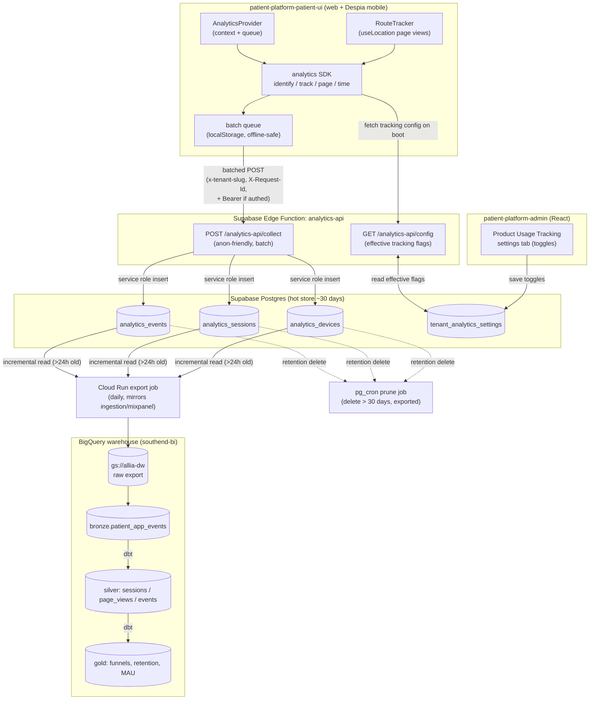
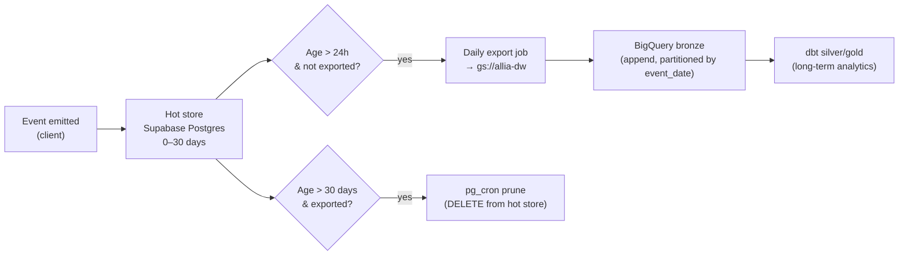
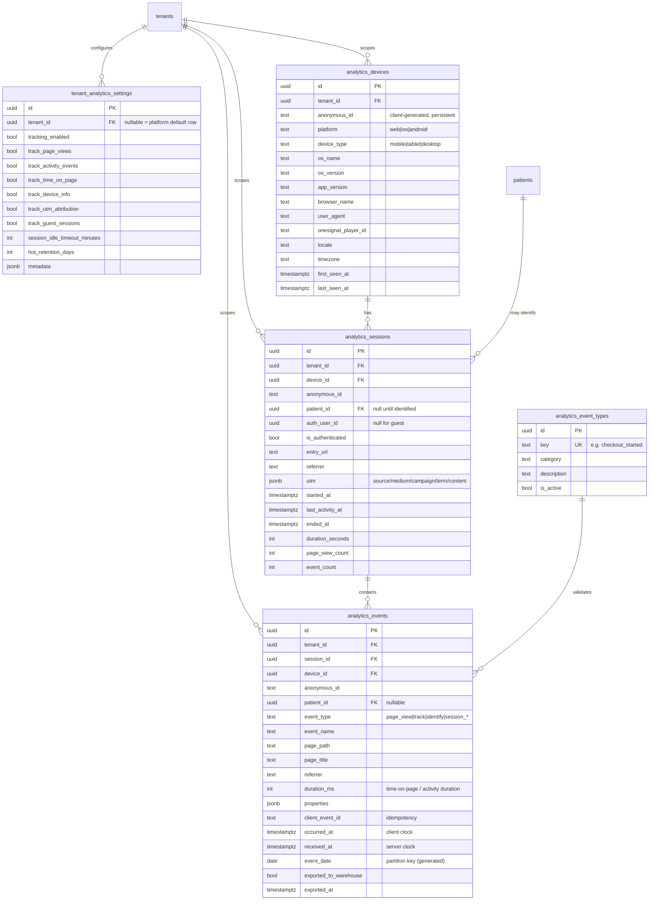
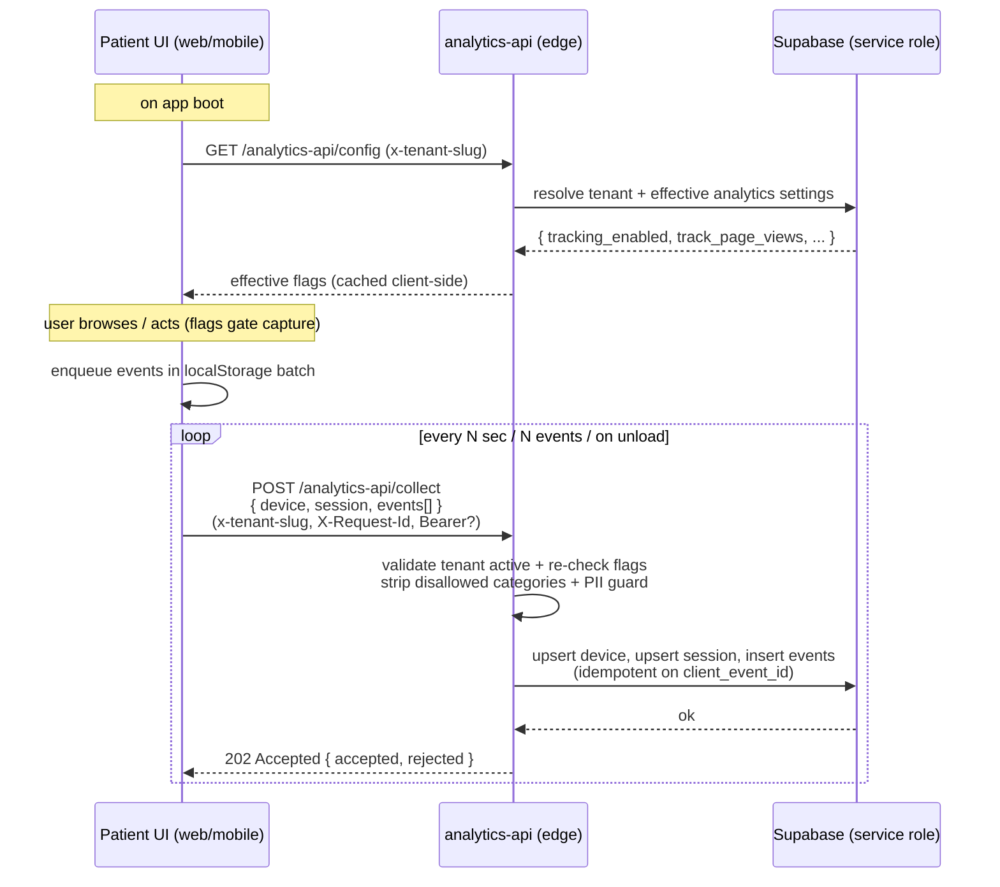
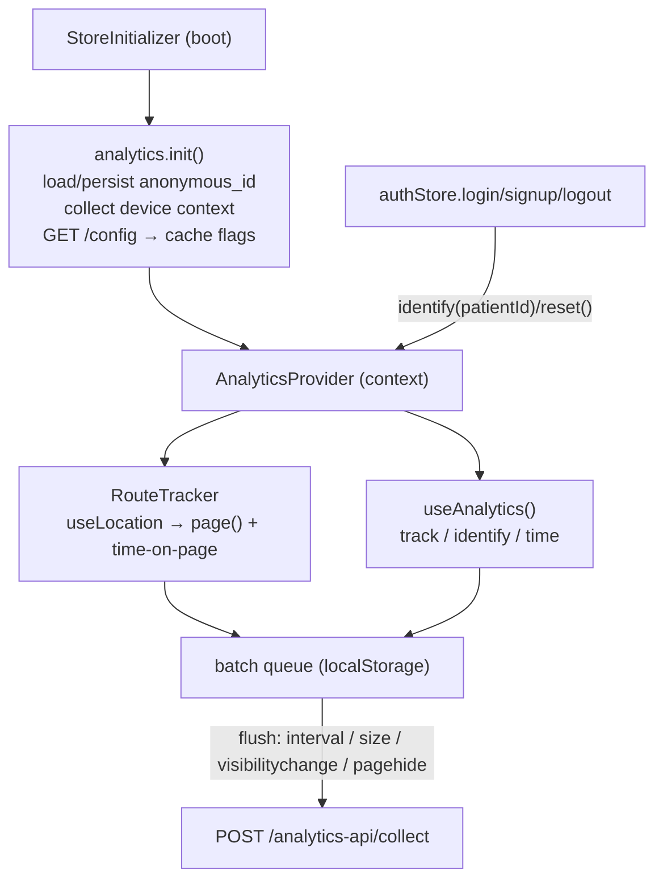
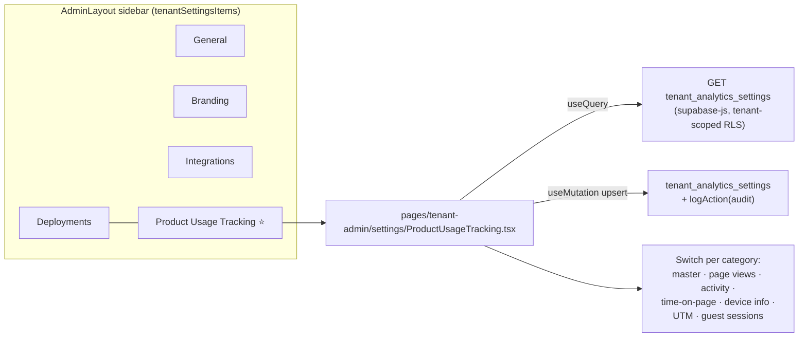
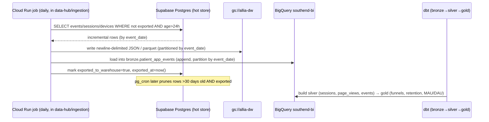

# Product Usage Tracking — Architecture & Implementation Plan

> **Status:** Phases 1–3 implemented (in review) · **Owner:** Data Platform · **Branch:** `feature/analytics-event-tracking` (off `development`) · API reference: [AnalyticsAPI.md](./AnalyticsAPI.md)
> **Scope:** First-party **User & Product Usage analytics** ("our own Mixpanel") for the patient platform — web + mobile, authenticated + guest — with per-tenant tracking controls, short-lived session storage in Supabase, and migration to the BigQuery data warehouse for long-term analytics.

> **Framing (decided).** This is **User & Product Usage analytics** — behavioural: who uses the app, how, which flows, funnels, retention, drop-off. It is **distinct from the existing "Analytics" dashboard**, which is **Business analytics — Revenue / Orders / Acquisition** (`src/pages/tenant-admin/Analytics.tsx` + `get_analytics_*` RPCs). The two remain separate concerns.
> <br/>
> **UI phasing (decided):**
> - **Now (this plan):** ship only the **collection controls** — a tenant-settings screen named **"Product Usage Tracking"**, placed in tenant settings **near Deployments**. No new dashboard in this phase; we stand up the pipeline (capture → hot store → warehouse) and the per-tenant opt-in.
> - **Future (out of scope here):** a dedicated **"Product Usage"** section (separate from the Business "Analytics" dashboard) to visualise trends/funnels/retention, fed from the warehouse. Noted so today's IA choices are deliberate. See [§9](#9-relationship-to-existing-analytics).

---

## 1. Goal & Non-Goals

### 1.1 Goal

Build a **first-party, tenant-aware product-analytics pipeline** that captures the full behavioural funnel of patients across `patient-platform-patient-ui` (web + Despia-wrapped mobile), for **both authenticated and unauthenticated (guest) users**, including:

- **Identity & device context** — anonymous device/visitor IDs, session IDs, OneSignal player ID, user agent, device type, platform (web/ios/android via Despia), app version, screen size, locale, timezone, referrer/UTM.
- **Page / screen visits** — route changes via React Router, with referrer and time-on-page.
- **Activity & interaction events** — named events with arbitrary properties (`mixpanel`-style `track(eventName, props)`), e.g. `product_viewed`, `checkout_started`, `questionnaire_step_completed`, `order_paid`.
- **Time tracking** — dwell time per page/activity, session duration, idle/active time.

Tenants control **what is tracked** via a new **"Product Usage Tracking" tab** in tenant settings (placed near Deployments; opt-in toggles per tracking category, with platform defaults + per-tenant overrides — mirroring the existing feature-flag pattern).

Operationally: **Supabase stores a hot window of ~30 days of session/event data**, after which a scheduled export **migrates the data to the BigQuery warehouse** (`southend-bi`) for long-term analytics, then prunes the hot store.

### 1.2 Non-Goals (this phase)

- **Touching the existing Business Analytics dashboard.** `src/pages/tenant-admin/Analytics.tsx` and the `get_analytics_*` RPCs (Revenue / Orders / Acquisition) stay exactly as-is. This feature adds a separate **User & Product Usage** stream. See [§9 Relationship to existing analytics](#9-relationship-to-existing-analytics).
- ~~**Building a Product Usage dashboard now.**~~ **Update:** a read-only **"Product Usage"** viewer now ships in the tenant Workspace nav (KPIs, daily events/sessions time series, top pages/events, recent sessions), reading the hot store via tenant-scoped `SECURITY INVOKER` RPCs (`get_product_usage_*`). It intentionally shows only hot-store data (last `hot_retention_days`); cross-tenant / long-range analytics remain a warehouse concern. See [§9](#9-relationship-to-existing-analytics).
- **Replacing the third-party Mixpanel ingestion** in `data-hub/ingestion/mixpanel/` immediately. Our pipeline mirrors that proven pattern; cut-over is a later decision.
- **Building the long-term BI dashboards** in this repo. Those live in the warehouse / Looker layer (`data-hub`).
- **HIPAA-grade PHI in events.** Events must carry *behavioural* data, not PHI. See [§8 Privacy, PII & compliance](#8-privacy-pii--compliance).

---

## 2. How the platform works today (baseline)

Grounded in the existing `docs/` and the current code on `development`.

| Concern | Current state |
|---|---|
| **Admin backend** | `patient-platform-admin` — Supabase (Postgres + Edge Functions in Deno) + React admin UI. Working branch `development`. |
| **Patient app** | `patient-platform-patient-ui` — React 18 + Vite + Zustand + React Query + React Router. **Mobile = Despia** native wrapper around the same web build (`despia-native`). |
| **Patient → backend** | Patient UI does **not** use the supabase-js SDK. It calls Edge Functions through a custom `src/lib/apiClient.ts` fetch wrapper that already sets `apikey`, `x-tenant-slug`, **`X-Request-Id`**, `X-API-Version`, and a `Bearer` token when authenticated. |
| **Tenant resolution** | Client: `appConfig.tenantId` from `VITE_AHPP_TENANT_ID` (env-per-deployment, not subdomain). Backend: edge functions resolve tenant from `x-tenant-slug` header / `tenant_slug` query param against `tenants.slug` where `status='active'`. |
| **Tenant config model** | `tenants`, `tenant_branding`, `tenant_settings`, `feature_flags` + `tenant_feature_flag_overrides` (platform default + tenant override), `tenant_integrations` (`integration_key`, `is_enabled`, `settings JSONB`), `tenant_module_subscriptions`. |
| **Identity** | `admin_users.auth_user_id` ↔ `auth.users`. `patients.auth_user_id` ↔ `auth.users`, **nullable** for guest patients (signup flow creates `auth_user_id = null` guests). Email unique per `(tenant_id, email)`. |
| **RLS** | Security-definer helpers: `get_user_tenant_ids(auth.uid())`, `is_platform_superadmin()`, `is_tenant_admin()`, `get_patient_by_auth_id()`. Tenant-scoped policies; **patients have no superadmin read** on PHI tables; service role bypasses RLS in edge functions. |
| **Edge function shape** | `supabase/functions/<name>/index.ts` + `_shared/` (`cors.ts`, `environment.ts`, auth helpers…). `verify_jwt = false` in `config.toml`; functions do their own auth. Migrations named `YYYYMMDDHHMMSS_<uuid|slug>.sql`. |
| **Existing event-ish tables** | `audit_logs` (admin actions, has `ip_address`, `user_agent`, `request_id`), `order_status_history`, `subscription_events`, `rtdh_event_payloads`. All **server-side domain events** — none capture client behaviour. |
| **Existing client analytics** | **None.** No mixpanel/segment/posthog/amplitude/gtag in `patient-platform-patient-ui`. Intercom is present for support only. |
| **Warehouse** | `data-hub` — medallion dbt (bronze→silver→gold) on BigQuery `southend-bi`. Ingestion = per-source Cloud Run jobs → `gs://allia-dw` / BigQuery raw. **Mixpanel already ingested** (`ingestion/mixpanel/export_mixpanel_events.py`). Postgres sources replicated (`sp_bg_all` = LifeFile). |

**Key takeaway:** every architectural primitive we need already exists — a tenant override pattern, a request-id-carrying API client, an edge-function ingestion shape, and a warehouse ingestion pattern (incl. a Mixpanel precedent). This feature *composes* them rather than inventing new infrastructure.

---

## 3. Target architecture



### 3.1 Data lifecycle (hot → warm → cold)



**Why this split:**
- **Hot store (Supabase, ≤30 days):** powers real-time/near-real-time needs (live session debugging, recent-activity admin views) and acts as a durable buffer so a warehouse export hiccup never loses events.
- **Warehouse (BigQuery, forever):** all long-term behavioural analytics — funnels, retention, cohort, attribution — joined to existing gold marts (orders, subscriptions, patients) in `southend-bi`.
- The 30-day window is **much longer than the 24h export cadence on purpose**: export runs daily, prune only removes rows that are both >30 days old *and* confirmed exported, giving ~29 days of retry headroom.

---

## 4. Data model changes (Supabase)

All new tables live in `public`, are **tenant-scoped** (`tenant_id NOT NULL` except the platform-default settings rows), partition-friendly (time-ordered), and follow existing naming/RLS conventions. New migrations go in `supabase/migrations/` using the `YYYYMMDDHHMMSS_<slug>.sql` convention.



### 4.1 Table notes

- **`tenant_analytics_settings`** — mirrors `tenant_settings` / feature-flag override semantics. A row with `tenant_id IS NULL` is the **platform default**; a row per tenant overrides it. The `analytics-api/config` endpoint returns the *effective* flags (tenant override if present, else platform default). Includes operational knobs: `session_idle_timeout_minutes` (default 30), `hot_retention_days` (default 30).
- **`analytics_devices`** — one row per `(tenant_id, anonymous_id)`. The `anonymous_id` is a UUID generated client-side on first load and persisted in `localStorage` (survives across guest→auth transition so we can stitch pre-login behaviour to the patient). Device columns captured from `navigator`, `window`, and the Despia bridge.
- **`analytics_sessions`** — opened on first event of a session, closed by idle timeout or explicit end. `patient_id`/`auth_user_id` backfilled on `identify`. `duration_seconds`, `page_view_count`, `event_count` maintained by trigger or roll-up so the hot store can answer "current session" cheaply.
- **`analytics_events`** — the firehose. `client_event_id` + unique index gives **idempotent ingestion** (safe client retries / offline replay). `event_date` is a **generated column** (`received_at::date`) used as the partition/prune key and the warehouse partition key. `exported_to_warehouse` drives the export→prune handshake.
- **`analytics_event_types`** — optional governance/allowlist of known event names (seeded with the platform's canonical events). Lets the admin UI present a catalog and lets the warehouse model trust the event vocabulary. Unknown events are still accepted (logged), but flagged.

### 4.2 Indexes & partitioning

- `analytics_events`: btree on `(tenant_id, occurred_at DESC)`, `(session_id)`, `(anonymous_id)`, partial index `WHERE exported_to_warehouse = false` for the export job, unique on `(tenant_id, client_event_id)`. Consider native `PARTITION BY RANGE (event_date)` if volume warrants (Postgres declarative partitioning) — start unpartitioned, revisit at volume.
- `analytics_sessions`: `(tenant_id, started_at DESC)`, `(device_id)`, `(patient_id)`.
- `analytics_devices`: unique `(tenant_id, anonymous_id)`.

### 4.3 RLS

Following the existing model exactly:

| Table | Patient (self) | Tenant admin | Superadmin | Service role |
|---|---|---|---|---|
| `analytics_events` | ❌ (no read) | ✅ `tenant_id IN get_user_tenant_ids(auth.uid())` | ❌ (behavioural ≈ PHI-adjacent; exclude like patient/order) | ✅ insert/select/delete |
| `analytics_sessions` | ❌ | ✅ tenant-scoped | ❌ | ✅ |
| `analytics_devices` | ❌ | ✅ tenant-scoped | ❌ | ✅ |
| `tenant_analytics_settings` | ❌ | ✅ tenant-scoped (manage own); read platform-default row | ✅ manage platform defaults | ✅ |
| `analytics_event_types` | ❌ | ✅ read | ✅ manage | ✅ |

Ingestion writes go through the **service role** inside the edge function (clients never hit Postgres directly — same as `tenant-info`), so anon/guest writes are mediated and validated server-side. Admin reads use the tenant-admin RLS path via supabase-js (same as `TenantIntegrationSettings`).

> **Decision needed:** whether superadmin (platform) can read cross-tenant behavioural events. Current PHI policy *excludes* superadmin from patient/order/subscription. Behavioural events are PHI-adjacent (they reveal a patient's app activity). Recommend **excluding superadmin from the raw hot store** and serving any cross-tenant platform analytics from the **warehouse** (already access-controlled via `data-bi-ai@alliahealth.co`). See [§11 Open questions](#11-open-questions).

---

## 5. Backend changes (Edge Functions)

New edge function **`analytics-api`** under `supabase/functions/analytics-api/`, registered in `config.toml` with `verify_jwt = false` (does its own auth, like every other function). Reuses `_shared/cors.ts` and `_shared/environment.ts`.



### 5.1 Endpoints

| Method | Path | Auth | Purpose |
|---|---|---|---|
| `GET` | `/analytics-api/config` | anon (tenant via header) | Return **effective** tracking flags so the client only sends what's enabled. |
| `POST` | `/analytics-api/collect` | anon-friendly; uses `Bearer` to set `auth_user_id`/`patient_id` when present | Batch ingest device + session + events. Idempotent. |
| `GET` | `/analytics-api/events` *(admin, optional)* | tenant-admin JWT | Recent-activity read for an admin "live sessions" view (hot store only). |

### 5.2 Server-side guardrails (defence in depth)

The client gates capture by flags, **and the server re-enforces**:
- Re-read `tenant_analytics_settings`; drop any event category the tenant disabled (page views, activity, time, device, UTM, guest sessions).
- If `track_guest_sessions = false` and no `Bearer`, reject the batch.
- **PII guard:** reject/sanitise events whose `properties` contain disallowed keys (email, phone, DOB, address, free-text health fields) — an allowlist/denylist on property keys. Keeps PHI out of the behavioural stream.
- Rate-limit per `anonymous_id` / IP; cap batch size and `properties` payload size.
- Tenant must be `status='active'` (same check as `tenant-info`).

---

## 6. Frontend changes — patient UI (web + mobile)

New lightweight SDK in `patient-platform-patient-ui/src/services/analytics/` (no third-party dependency — homegrown). Despia gives us mobile for free since it wraps the same web build; platform/device are detected at runtime.



### 6.1 SDK surface (`mixpanel`-style)

```ts
analytics.init()                          // boot: anon id + device ctx + fetch flags
analytics.page(path, title?, props?)      // page/screen view (auto via RouteTracker)
analytics.track(eventName, props?)        // named activity event
analytics.identify(patientId, authUserId) // on login/signup — stitches guest → patient
analytics.timeEvent(name) / track(name)   // duration tracking for activities
analytics.reset()                         // on logout — new anon session, drop identity
```

### 6.2 Integration points (grounded in current code)

- **Boot:** call `analytics.init()` from `src/stores/StoreInitializer.tsx` (already runs `initializeTenant()` + `initializeAuth()` on mount). Wrap the tree in `AnalyticsProvider` inside `QueryClientProvider` in `src/App.tsx`.
- **Page views:** a `<RouteTracker/>` inside `<BrowserRouter>` using `useLocation()` (already imported in `App.tsx`) → `analytics.page()` + close previous page's time-on-page.
- **Identity stitching:** in `src/stores/authStore.ts`, call `analytics.identify(patientId, authUserId)` right where `registerOneSignalDevice(authUserId)` is called today; call `analytics.reset()` in `logout()`.
- **Device/context:** reuse `useIsMobile`, `navigator.userAgent`, `window.screen`, `Intl.DateTimeFormat().resolvedOptions().timeZone`, and the **Despia** bridge for `onesignal_player_id` / app version. Platform inferred via Despia presence.
- **Transport:** the SDK posts through a thin client mirroring `src/lib/apiClient.ts` headers (`apikey`, `x-tenant-slug`, `X-Request-Id`, `Bearer` when authed). Offline-safe `localStorage` queue, flushed on interval / batch-size / `visibilitychange` / `pagehide` (use `navigator.sendBeacon` on unload where available).
- **Flag gating:** SDK no-ops for any category disabled by the cached `/config` response, so a tenant that turns off (e.g.) time tracking sends nothing for it.

> **No changes** to the existing `apiClient.ts` request contract, auth store shape, or routing structure — the SDK hooks in additively.

### 6.3 Named event vocabulary (SHIPPED 2026-07-16 — patient-ui PR #417)

THE RULE: a name exists in the catalogs (automation trigger dropdown =
`analytics_event_types` active rows; webhook events = `usage.<name>`) **only if
the patient UI actually emits it**. The instrumented `analytics.track()` call
sites:

| Event | Fired from | Properties |
|---|---|---|
| `login` | authStore — explicit sign-ins only (`login`, `verifyOtp`, `resolveOAuthSession`, `signInWithPasskey`, `loginWithDemoPasswordlessCode`, signup auto-login). Session restores (`initialize`/`refreshUser`) identify WITHOUT tracking. | `method`: password \| otp \| google \| passkey \| demo_passwordless \| signup |
| `signup_started` | SignUpPage mount | `source` |
| `signup_completed` | SignUpPage submit; authStore.signUp; checkout `ensureAccount` | `source`: signup_page \| checkout |
| `product_viewed` | ProductDetailPage (once per product) | `product_id` |
| `checkout_started` | PurchaseCheckoutPage once the product loads (skipped on OAuth `?resumeOrder`) | `product_id` |
| `checkout_completed` | checkout step-1 `onContinue` (payment authorized) | `product_id`, `order_id` |
| `questionnaire_started` | OrderQuestionnairePage when the payload loads with pending work | `order_id` |
| `questionnaire_step_completed` | per accepted answer | `order_id`, `question_id` |
| `questionnaire_completed` | sequential + MDI submit paths (NOT already-complete-on-load) | `order_id` |

`page_view` / `session_start` / `session_end` are deactivated as trigger names:
page views are an event TYPE with `event_name NULL` (a name trigger can never
match) and the SDK never emits session events. Property keys must pass the
PII key filter (`method`, `source`, `order_id`, `product_id`, `question_id` do).

Consumers per accepted event: comms automations (`emitCommsEvent` — one per
distinct `event_name`, with the event's `client_event_id` as `entity_id` for
per-occurrence dedup) and outbound webhooks (`usage.<name>` first-class key,
falling back to `usage.page_view` / `usage.activity_event`).

---

## 7. Admin UI changes — "Product Usage Tracking" settings tab

A new **per-tenant "Product Usage Tracking" settings** screen lets tenants opt into tracking categories. It is placed in the tenant-settings sidebar **next to Deployments**. Follows the exact pattern of `General.tsx` / `TenantIntegrationSettings.tsx` (React Query load + `useMutation` upsert + shadcn `Switch` + `useAuditLog`). **This phase ships toggles only — no dashboard.**



**Wiring (matches existing conventions):**
- Route constant `PRODUCT_USAGE_TRACKING: '/tenant-admin/settings/product-usage-tracking'` in `src/lib/constants.ts`.
- Register route in `src/App.tsx` under `<ProtectedRoute requireTenantAdmin>`.
- Sidebar item in `src/components/layouts/AdminLayout.tsx` `tenantSettingsItems`, **immediately after the Deployments entry** (icon e.g. `Activity`/`MousePointerClick`). Label: **"Product Usage Tracking"**.
- Page `src/pages/tenant-admin/settings/ProductUsageTracking.tsx` (heavy logic optionally in `src/components/features/ProductUsageTrackingSettings.tsx`).
- Master `tracking_enabled` toggle disables children; "Customized" badge when a tenant value differs from the platform default (same UX as feature flags).

> **Naming note.** The DB tables/columns keep the neutral `analytics_*` / `tenant_analytics_settings` names — the database + API are the stable contract and also feed the future Product Usage dashboard and the warehouse. Only the **user-facing label** is "Product Usage Tracking". This avoids a churny rename if the surfaced product name evolves.

---

## 8. Privacy, PII & compliance

- **Behavioural, not clinical.** Events carry navigation + interaction metadata. **No PHI** in `properties` — enforced by the server-side PII guard (denylist on property keys) and by reviewing every canonical event in `analytics_event_types`.
- **Guest tracking is opt-in per tenant** (`track_guest_sessions`). When off, anonymous traffic is not persisted.
- **Identity stitching** links a guest `anonymous_id` to `patient_id` only *after* the patient authenticates — consistent with the existing guest→patient signup model (`patients.auth_user_id` nullable).
- **RLS** keeps behavioural data tenant-isolated and out of superadmin reach in the hot store (see [§4.3](#43-rls)); cross-tenant platform analytics come from the access-controlled warehouse.
- **Retention:** hot store auto-pruned at `hot_retention_days` (default 30). Warehouse retention governed by `data-hub` policy.
- **IP handling:** capture coarse signals (country) rather than storing raw IP long-term where avoidable; final IP policy is an [open question](#11-open-questions).

---

## 9. Relationship to existing analytics

Two distinct analytics concerns, kept separate:

| | **Business Analytics** (existing) | **User & Product Usage** (this feature) |
|---|---|---|
| Covers | Revenue / Orders / Acquisition | who uses the app, how, flows, funnels, retention, drop-off |
| Where | `src/pages/tenant-admin/Analytics.tsx` + `get_analytics_*` RPCs | new `analytics-*` tables + `analytics-api` + warehouse models |
| Source | operational tables (orders, subscriptions) | client behavioural events (page/activity/time) |
| Question | "how much revenue, how many orders, where did they come from" | "how do users move through the product; where do they drop" |
| Lives | admin Postgres, queried live | hot store (5d) → BigQuery (long-term) |
| Surface today | "Analytics" dashboard | **settings-only:** "Product Usage Tracking" toggles |
| Surface future | unchanged | dedicated **"Product Usage"** dashboard (warehouse-fed) |

They are **complementary**. Naming is **resolved**: the collection screen is **"Product Usage Tracking"** (tenant *settings*, near Deployments); the existing **"Analytics" dashboard** keeps its name for Business analytics. When the future visualisation surface ships, it will be a separate **"Product Usage"** section — not folded into the Business "Analytics" dashboard.

---

## 10. Warehouse migration (Supabase → BigQuery)

Mirrors the **proven `data-hub` ingestion pattern** (per-source Cloud Run job → `gs://allia-dw` → BigQuery raw/bronze → dbt silver/gold). There is already a Mixpanel precedent (`ingestion/mixpanel/export_mixpanel_events.py`) and a Postgres-replication precedent (`sp_bg_all`).



- **Extraction:** new job under `data-hub/ingestion/patient_app_analytics/` modeled on `ingestion/mixpanel/`. Incremental on `event_date` / `exported_to_warehouse`; idempotent (warehouse keyed on `client_event_id`).
- **Bronze:** `bronze.patient_app_events` (+ sessions, devices), partitioned by `event_date`, registered in `dbt_allia/models/bronze/sources.yml`.
- **Silver/Gold:** dbt models for sessionised page views, event funnels, and patient-level rollups, **joinable to existing gold marts** (orders/subscriptions/patients) on `patient_id`/`tenant_id`.
- **Prune (window-based, shipped):** `prune_analytics_hot_store(p_dry_run)` deletes rows older than the tenant's **effective** `hot_retention_days` (tenant override → platform default → 30). Events first, then orphan sessions/devices; `p_dry_run = true` reports counts without deleting. Scheduled nightly (03:17 UTC) via `pg_cron`. Granted to `service_role` only.
  - History: introduced export-gated in `20260617160000` (only deleted `exported_to_warehouse = true` rows); fallback baseline raised 5 → 30 in `20260708120000`; **`20260709120000` dropped the export gate** so the prune now clears the hot store strictly by the per-tenant window. The BigQuery warehouse copy is owned by a separate team — the hot-store cleanup no longer waits on it. `hot_retention_days` is bounded **7–90** (CHECK) and admin-editable in the Product Usage Tracking settings tab.
- **Access:** warehouse behavioural data governed by the existing `data-bi-ai@alliahealth.co` group / IAM (`allia-infrastructure/groups.yaml`).

> This section's concrete deliverables land in **`data-hub`**, not this repo — cross-referenced here so the end-to-end picture is in one place. A companion plan doc will live in `data-hub/docs/`.

---

## 11. Open questions (need product/eng decisions)

**Resolved**
- ✅ **Framing & naming** — this is **User & Product Usage analytics**, distinct from the existing **Business Analytics** dashboard (Revenue/Orders/Acquisition). The collection screen is **"Product Usage Tracking"** in tenant settings, placed **near Deployments**. A dedicated visualisation surface is a **future** "Product Usage" section, not part of this phase.

**Still open**
1. **Superadmin access to hot store** — exclude platform superadmin from raw behavioural events (recommended) and serve cross-tenant analytics from the warehouse only?
2. **IP address** — store raw, store hashed, or derive country-only? (HIPAA/region-privacy implications.)
3. **Event vocabulary governance** — strict allowlist via `analytics_event_types` (reject unknown) vs permissive (accept + flag)? Recommend permissive now, tighten later.
5. **Partitioning** — start `analytics_events` unpartitioned and add declarative partitioning at volume, or partition from day one?
6. **Sampling** — any need for client-side sampling at high volume, or capture 100% (volumes likely modest for a patient app)?
7. **Consent/cookie banner** — does guest tracking require an explicit consent UI in the patient app per jurisdiction?
8. **Mixpanel cut-over** — is the intent to *replace* the third-party Mixpanel ingestion, or run both during validation?
9. **Target Supabase project(s)** — dev `sunzxjnbgtknqeivljtd` confirmed for build; staging/prod refs (`rhzrxfckhogjppjsioyn`, `dfejvhgwqhywmtxyxkyo` per `config.toml`) for rollout.

---

## 12. Phased delivery plan

| Phase | Deliverable | Repos | Status |
|---|---|---|---|
| **0. Plan (this doc)** | Architecture + data model + open-question signoff | `patient-platform-admin/docs` | ✅ Done |
| **1. Schema + settings** | Migration (5 tables + RLS + seed); "Product Usage Tracking" settings tab | `patient-platform-admin` | ✅ Done (PR #86) |
| **2. Ingestion API** | `analytics-api` edge function (`/config`, `/collect`) with PII guard + batch limits ([AnalyticsAPI.md](./AnalyticsAPI.md)) | `patient-platform-admin` | ✅ Done (PR #86) |
| **3. Client SDK** | Homegrown SDK + `AnalyticsProvider` + `RouteTracker` + identity stitching; flag-gated | `patient-platform-patient-ui` | ✅ Done (PR) |
| **4. Hot-store ops** | `prune_analytics_hot_store()` + guarded nightly `pg_cron` schedule; export-before-prune handshake; recent-activity admin read = RLS-only direct query | `patient-platform-admin` | ✅ Done (PR #86) |
| **5. Warehouse** | Cloud Run export job, bronze source, dbt silver/gold, IAM | `data-hub` (+ `allia-infrastructure`) | ⏳ Planned |
| **6. Validate & roll out** | Dev → staging → prod; verify funnels in warehouse; tenant enablement | all | ⏳ Planned |

> Phase 1 added a **5th table** (`analytics_event_types`) and a `bump_analytics_session_counters` RPC beyond the original 4-table sketch.

---

## 13. What changes vs. what does not

**Changes (additive):**
- New tables `tenant_analytics_settings`, `analytics_devices`, `analytics_sessions`, `analytics_events`, `analytics_event_types` (+ RLS, indexes, seed).
- New edge function `analytics-api` (+ `config.toml` entry).
- New admin settings screen + route + sidebar item + constants.
- New client analytics SDK + provider + route tracker; small additive calls in `StoreInitializer` and `authStore`.
- New `data-hub` ingestion job + dbt models + bronze source.

**Does NOT change:**
- Existing `Analytics.tsx` dashboard, `get_analytics_*` RPCs, and operational tables.
- `apiClient.ts` request contract, auth/session model, tenant resolution, routing structure.
- Existing edge functions, RTDH/Stripe/Telegra flows, signup flow (PP-566) — untouched.
- Third-party Mixpanel ingestion (kept until a cut-over decision).
- Patient/admin RLS helper functions (reused, not modified).

---

*End of plan. Update [§11 Open questions](#11-open-questions) as decisions are made, then proceed to Phase 1.*
