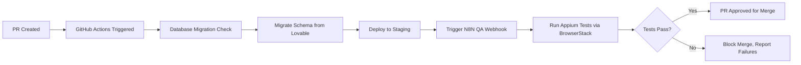
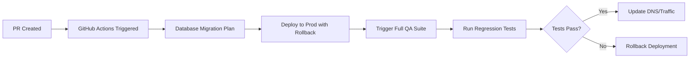

# Architecture Best Practices & Guidelines

> **Purpose**: This document defines the architectural standards, patterns, and workflows for AI-assisted development using Lovable, Cursor, Codex, and Claude Code.

---

## Table of Contents

1. [Core Architectural Principles](#core-architectural-principles)
2. [Environment & Branch Strategy](#environment--branch-strategy)
3. [CI/CD Pipeline Architecture](#cicd-pipeline-architecture)
4. [Service Architecture Patterns](#service-architecture-patterns)
5. [Database Architecture](#database-architecture)
6. [API & Integration Patterns](#api--integration-patterns)
7. [Mobile Architecture](#mobile-architecture)
8. [Agentic Workflow Patterns](#agentic-workflow-patterns)
9. [Deployment Architecture](#deployment-architecture)
10. [Quality Assurance Architecture](#quality-assurance-architecture)

---

## Core Architectural Principles

### 1. Separation of Concerns
- **Frontend**: Pure presentation layer (React/Vite)
- **Backend**: Business logic layer (Supabase Edge Functions/Cloud Functions)
- **Data**: Persistence layer (Supabase PostgreSQL/Cloud SQL)
- **Integration**: Middleware layer (Despia for mobile, N8N for workflows)

### 2. Cloud-Native Design
- Stateless services for horizontal scaling
- Event-driven architecture for async operations
- API-first design for interoperability
- Containerized deployments

### 3. Provider Flexibility
- Abstract all provider-specific implementations
- Use environment variables for configuration
- Maintain portable SQL and standard APIs
- Design for migration (Supabase → GCP)

### 4. Security First
- Zero-trust architecture
- API authentication on all endpoints
- Row-level security on database
- Secrets management via environment variables
- HTTPS/TLS everywhere

---

## Environment & Branch Strategy

### Branch Structure

```
main (prod)
├── staging
│   ├── dev
│   │   ├── feature/[feature-name]
│   │   ├── feature/[feature-name]
│   │   └── feature/[feature-name]
```

### Environment Configuration

#### **Dev Branch**
- **Platform**: Lovable Cloud
- **Backend**: Supabase (Lovable-managed)
- **Database**: Supabase PostgreSQL (dev instance)
- **Purpose**: Rapid prototyping, feature development
- **Workflow**:
  - Create feature branches from `dev`
  - Use Lovable's branch switching for isolated development
  - Merge features back to `dev` via PR

#### **Staging Branch**
- **Platform**: Self-hosted (Vercel/Cloud Run)
- **Backend**: Own Supabase instance or GCP
- **Database**: Dedicated PostgreSQL (staging instance)
- **Purpose**: Integration testing, UAT, pre-production validation
- **Workflow**:
  - Merge `dev` → `staging` triggers:
    1. GitHub Actions pipeline
    2. Database migration from Lovable Cloud
    3. Deployment to Vercel/Cloud Run
    4. QA automation via N8N webhook

#### **Prod Branch (main)**
- **Platform**: Production infrastructure (Vercel/Cloud Run)
- **Backend**: Production Supabase/GCP Cloud SQL
- **Database**: Production PostgreSQL (dedicated instance)
- **Purpose**: Live production environment
- **Workflow**:
  - Merge `staging` → `main` triggers:
    1. Production deployment pipeline
    2. Database migrations with rollback capability
    3. Full QA automation suite
    4. Mobile app deployments (if applicable)

---

## CI/CD Pipeline Architecture

### Pull Request Workflow

#### Dev → Staging


#### Staging → Prod


### GitHub Actions Template

```yaml
name: Deploy to Staging

on:
  pull_request:
    branches: [staging]
    types: [opened, synchronize]

jobs:
  migrate-database:
    runs-on: ubuntu-latest
    steps:
      - uses: actions/checkout@v3
      - name: Migrate from Lovable Cloud
        run: |
          # Export schema from Lovable Supabase
          # Apply migrations to staging database

  deploy:
    needs: migrate-database
    runs-on: ubuntu-latest
    steps:
      - name: Deploy to Vercel
        run: vercel deploy --prod

  qa-automation:
    needs: deploy
    runs-on: ubuntu-latest
    steps:
      - name: Trigger N8N QA Workflow
        run: |
          curl -X POST ${{ secrets.N8N_WEBHOOK_URL }} \
            -H "Content-Type: application/json" \
            -d '{"environment": "staging", "pr": "${{ github.event.pull_request.number }}"}'
```

---

## Service Architecture Patterns

### 1. Layered Architecture

```
┌─────────────────────────────────────┐
│     Presentation Layer              │
│  (React Components, Pages, UI)      │
└─────────────┬───────────────────────┘
              │
┌─────────────▼───────────────────────┐
│     Application Layer               │
│  (Hooks, State Management, Logic)   │
└─────────────┬───────────────────────┘
              │
┌─────────────▼───────────────────────┐
│     Integration Layer               │
│  (API Clients, Auth, Abstractions)  │
└─────────────┬───────────────────────┘
              │
┌─────────────▼───────────────────────┐
│     Services Layer                  │
│  (Edge Functions, Cloud Functions)  │
└─────────────┬───────────────────────┘
              │
┌─────────────▼───────────────────────┐
│     Data Layer                      │
│  (Database, Storage, Cache)         │
└─────────────────────────────────────┘
```

### 2. Folder Structure Standards

```
/
├── src/
│   ├── components/          # Reusable UI components
│   │   ├── ui/             # Base design system components
│   │   ├── features/       # Feature-specific components
│   │   └── layouts/        # Layout components
│   ├── pages/              # Route pages
│   │   ├── auth/           # Authentication pages
│   │   └── app/            # Protected application pages
│   ├── lib/                # Core utilities & abstractions
│   │   ├── auth.ts         # Authentication abstraction
│   │   ├── db.ts           # Database abstraction
│   │   └── api.ts          # API client abstraction
│   ├── config/             # Configuration modules
│   │   ├── env.ts          # Environment variables
│   │   └── constants.ts    # Application constants
│   ├── db/                 # Database layer
│   │   ├── schema.ts       # Drizzle ORM schema
│   │   └── migrations/     # Database migrations
│   ├── hooks/              # Custom React hooks
│   ├── services/           # Business logic services
│   ├── integrations/       # Third-party integrations
│   │   ├── ai/            # AI service integrations
│   │   ├── analytics/     # Analytics integrations
│   │   └── payments/      # Payment integrations
│   └── types/              # TypeScript type definitions
├── supabase/
│   └── functions/          # Edge Functions (serverless)
├── docs/                   # Documentation (this folder)
└── tests/                  # Test files
```

### 3. Service Communication Patterns

#### **Synchronous (REST API)**
Use for:
- User-initiated actions requiring immediate response
- CRUD operations
- Authentication flows

```typescript
// Example: User profile fetch
GET /api/users/:id
Authorization: Bearer <token>
```

#### **Asynchronous (Webhooks/Events)**
Use for:
- Long-running processes
- External system notifications
- Background jobs

```typescript
// Example: Order processing
POST /webhooks/order-created
{
  "orderId": "12345",
  "userId": "user-abc",
  "timestamp": "2024-01-07T12:00:00Z"
}
```

#### **Real-time (WebSockets/Supabase Realtime)**
Use for:
- Live updates (chat, notifications)
- Collaborative features
- Dashboard monitoring

```typescript
// Example: Supabase subscription
const subscription = supabase
  .channel('notifications')
  .on('postgres_changes',
    { event: 'INSERT', schema: 'public', table: 'notifications' },
    (payload) => handleNewNotification(payload)
  )
  .subscribe()
```

---

## Database Architecture

### Schema Design Principles

1. **Normalization**: 3NF minimum for transactional data
2. **Denormalization**: Strategic for read-heavy operations
3. **Indexes**: On all foreign keys and query-heavy columns
4. **Constraints**: Enforce data integrity at database level
5. **Row-Level Security**: Enable on all tables

### Migration Strategy

#### Lovable Dev → Staging/Prod

```bash
# 1. Export schema from Lovable Supabase
supabase db dump --db-url $LOVABLE_DB_URL -f schema.sql

# 2. Generate migration diff
supabase db diff --file migration_name

# 3. Apply to staging
supabase db push --db-url $STAGING_DB_URL

# 4. Validate data integrity
npm run db:validate
```

### Schema Example (Drizzle ORM)

```typescript
// src/db/schema.ts
import { pgTable, uuid, text, timestamp, boolean } from 'drizzle-orm/pg-core';

export const users = pgTable('users', {
  id: uuid('id').primaryKey().defaultRandom(),
  email: text('email').notNull().unique(),
  name: text('name'),
  createdAt: timestamp('created_at').defaultNow(),
  updatedAt: timestamp('updated_at').defaultNow()
});

export const projects = pgTable('projects', {
  id: uuid('id').primaryKey().defaultRandom(),
  name: text('name').notNull(),
  description: text('description'),
  ownerId: uuid('owner_id').references(() => users.id).notNull(),
  isActive: boolean('is_active').default(true),
  createdAt: timestamp('created_at').defaultNow(),
  updatedAt: timestamp('updated_at').defaultNow()
});

// Enable RLS
// ALTER TABLE projects ENABLE ROW LEVEL SECURITY;
// CREATE POLICY "Users can only see own projects" ON projects
//   FOR SELECT USING (auth.uid() = owner_id);
```

---

## API & Integration Patterns

### 1. API Design Standards

#### REST Endpoint Naming
```
GET    /api/resources           # List resources
GET    /api/resources/:id       # Get single resource
POST   /api/resources           # Create resource
PUT    /api/resources/:id       # Update resource (full)
PATCH  /api/resources/:id       # Update resource (partial)
DELETE /api/resources/:id       # Delete resource
```

#### Error Response Format
```json
{
  "error": {
    "code": "RESOURCE_NOT_FOUND",
    "message": "The requested resource does not exist",
    "details": {
      "resourceId": "12345",
      "resourceType": "project"
    },
    "timestamp": "2024-01-07T12:00:00Z"
  }
}
```

### 2. Webhook Integration Pattern

```typescript
// supabase/functions/webhook-handler/index.ts
import { serve } from 'https://deno.land/std@0.168.0/http/server.ts'

serve(async (req) => {
  // 1. Validate webhook signature
  const signature = req.headers.get('X-Webhook-Signature');
  if (!validateSignature(signature, req.body)) {
    return new Response('Unauthorized', { status: 401 });
  }

  // 2. Parse payload
  const payload = await req.json();

  // 3. Process event
  await processWebhookEvent(payload);

  // 4. Return 200 quickly (async processing)
  return new Response(JSON.stringify({ received: true }), {
    headers: { 'Content-Type': 'application/json' }
  });
});
```

### 3. Third-Party API Integration

```typescript
// src/integrations/external-api.ts
export class ExternalAPIClient {
  private baseUrl: string;
  private apiKey: string;

  constructor() {
    this.baseUrl = import.meta.env.VITE_EXTERNAL_API_URL;
    this.apiKey = import.meta.env.VITE_EXTERNAL_API_KEY;
  }

  async fetchData(endpoint: string) {
    try {
      const response = await fetch(`${this.baseUrl}${endpoint}`, {
        headers: {
          'Authorization': `Bearer ${this.apiKey}`,
          'Content-Type': 'application/json'
        }
      });

      if (!response.ok) {
        throw new Error(`API Error: ${response.statusText}`);
      }

      return await response.json();
    } catch (error) {
      // Centralized error handling
      throw new APIError('Failed to fetch data', error);
    }
  }
}
```

---

## Mobile Architecture

### Despia Middleware Integration

Despia acts as the bridge between your web backend and mobile applications.

```
┌──────────────┐
│  Mobile App  │
│  (iOS/Android)│
└──────┬───────┘
       │
┌──────▼────────┐
│    Despia     │  ← Middleware Layer
│  (API Gateway)│
└──────┬────────┘
       │
┌──────▼────────┐
│   Supabase/   │
│   GCP Backend │
└───────────────┘
```

### Mobile CI/CD Flow

```yaml
# .github/workflows/mobile-deploy.yml
name: Deploy Mobile App

on:
  push:
    branches: [main]

jobs:
  build-ios:
    runs-on: macos-latest
    steps:
      - name: Build iOS App
        run: |
          # Build iOS binary
          # Upload to TestFlight

  build-android:
    runs-on: ubuntu-latest
    steps:
      - name: Build Android App
        run: |
          # Build Android APK/AAB
          # Upload to Play Console

  qa-mobile:
    needs: [build-ios, build-android]
    runs-on: ubuntu-latest
    steps:
      - name: Run BrowserStack Tests
        run: |
          # Trigger Appium tests via N8N
          curl -X POST $N8N_MOBILE_WEBHOOK \
            -d '{"platform": "both", "build": "${{ github.sha }}"}'
```

### App Registration Workflow

1. **iOS (TestFlight)**
   - Build signed with distribution certificate
   - Upload via Xcode Cloud or Fastlane
   - Submit for TestFlight beta review
   - Distribute to internal testers

2. **Android (Play Console)**
   - Build signed with release keystore
   - Upload AAB to Play Console
   - Create internal testing track
   - Promote to alpha/beta/production

---

## Agentic Workflow Patterns

### N8N Integration Architecture

```
┌─────────────┐       ┌──────────┐       ┌────────────┐
│   GitHub    │──────▶│   N8N    │──────▶│  Appium    │
│   Actions   │ webhook│ Workflow │ trigger│   Tests    │
└─────────────┘       └──────────┘       └────────────┘
                            │
                            ▼
                      ┌──────────┐
                      │BrowserStack│
                      └──────────┘
```

### N8N Workflow Template (QA Automation)


```json
{
  "name": "QA Automation Workflow",
  "nodes": [
    {
      "type": "n8n-nodes-base.webhook",
      "parameters": {
        "path": "qa-trigger",
        "method": "POST"
      },
      "name": "Webhook Trigger"
    },
    {
      "type": "n8n-nodes-base.function",
      "parameters": {
        "functionCode": "// Parse PR details\nconst { environment, pr } = $input.item.json;\nreturn { environment, pr };"
      },
      "name": "Parse Request"
    },
    {
      "type": "n8n-nodes-base.httpRequest",
      "parameters": {
        "url": "https://api.browserstack.com/app-automate/sessions",
        "authentication": "predefinedCredentialType",
        "method": "POST",
        "body": {
          "platform": "web",
          "browser": "chrome",
          "test_suite": "regression"
        }
      },
      "name": "Run BrowserStack Tests"
    },
    {
      "type": "n8n-nodes-base.httpRequest",
      "parameters": {
        "url": "https://api.github.com/repos/{{$node['Webhook Trigger'].json.pr}}/comments",
        "method": "POST",
        "body": {
          "body": "QA Tests: {{$node['Run BrowserStack Tests'].json.status}}"
        }
      },
      "name": "Post Results to PR"
    }
  ]
}
```


### AI Agent Coordination

For complex workflows involving multiple AI agents:

```typescript
// src/services/agent-coordinator.ts
export class AgentCoordinator {
  async executeWorkflow(workflow: Workflow) {
    const tasks = workflow.tasks;

    for (const task of tasks) {
      // Route task to appropriate agent
      const agent = this.selectAgent(task.type);

      // Execute with context
      const result = await agent.execute(task, {
        previousResults: workflow.context,
        constraints: task.constraints
      });

      // Update context for next task
      workflow.context[task.id] = result;
    }

    return workflow.context;
  }
}
```

---

## Deployment Architecture

### Vercel Deployment

```json
// vercel.json
{
  "framework": "vite",
  "buildCommand": "npm run build",
  "outputDirectory": "dist",
  "env": {
    "VITE_SUPABASE_URL": "@supabase-url",
    "VITE_SUPABASE_ANON_KEY": "@supabase-anon-key"
  },
  "regions": ["iad1"],
  "functions": {
    "api/**/*.ts": {
      "memory": 1024,
      "maxDuration": 10
    }
  }
}
```

### Cloud Run Deployment

```dockerfile
# Dockerfile
FROM node:20-alpine AS builder
WORKDIR /app
COPY package*.json ./
RUN npm ci
COPY . .
RUN npm run build

FROM nginx:alpine
COPY --from=builder /app/dist /usr/share/nginx/html
COPY nginx.conf /etc/nginx/nginx.conf
EXPOSE 8080
CMD ["nginx", "-g", "daemon off;"]
```

```yaml
# cloudbuild.yaml
steps:
  - name: 'gcr.io/cloud-builders/docker'
    args: ['build', '-t', 'gcr.io/$PROJECT_ID/app:$SHORT_SHA', '.']
  - name: 'gcr.io/cloud-builders/docker'
    args: ['push', 'gcr.io/$PROJECT_ID/app:$SHORT_SHA']
  - name: 'gcr.io/google.com/cloudsdktool/cloud-sdk'
    entrypoint: gcloud
    args:
      - 'run'
      - 'deploy'
      - 'app'
      - '--image=gcr.io/$PROJECT_ID/app:$SHORT_SHA'
      - '--region=us-central1'
      - '--platform=managed'
```

---

## Quality Assurance Architecture

### Test Pyramid

```
        ┌────────────┐
        │    E2E     │  ← N8N + Appium + BrowserStack
        └────────────┘
      ┌──────────────┐
      │ Integration  │  ← API tests, component tests
      └──────────────┘
    ┌──────────────────┐
    │   Unit Tests     │  ← Jest/Vitest
    └──────────────────┘
```

### Appium Test Structure

```python
# tests/mobile/test_login.py
from appium import webdriver
from appium.options.android import UiAutomator2Options

class TestLogin:
    def setup_method(self):
        options = UiAutomator2Options()
        options.platform_name = 'Android'
        options.device_name = 'Google Pixel 7'
        options.app = 'bs://app-id'

        self.driver = webdriver.Remote(
            'https://hub.browserstack.com/wd/hub',
            options=options
        )

    def test_successful_login(self):
        # Find email input
        email_field = self.driver.find_element('id', 'email-input')
        email_field.send_keys('test@example.com')

        # Find password input
        password_field = self.driver.find_element('id', 'password-input')
        password_field.send_keys('password123')

        # Submit
        login_button = self.driver.find_element('id', 'login-button')
        login_button.click()

        # Assert success
        assert self.driver.find_element('id', 'dashboard')

    def teardown_method(self):
        self.driver.quit()
```

---

## Guardrails for AI Agents

When working with AI agents (Lovable, Cursor, Codex, Claude Code), enforce these guardrails:

### ✅ ALWAYS
- Abstract database and auth layers in `/lib`
- Use environment variables for configuration
- Create migrations for schema changes
- Maintain separation of concerns
- Follow folder structure standards
- Write portable, provider-agnostic code

### ❌ NEVER
- Hardcode credentials or URLs
- Use provider-specific features without abstraction
- Skip database migrations
- Mix business logic with presentation
- Deploy without automated tests
- Merge PRs without QA validation

### Prompt Template for Agents

```
You are developing a feature for a production system with the following architecture:

- Frontend: React + Vite + TypeScript
- Backend: Supabase Edge Functions / Cloud Functions
- Database: PostgreSQL (must be portable to Cloud SQL)
- Deployment: Multi-environment (dev → staging → prod)

Requirements:
1. Follow the architecture defined in /docs/Architecture.md
2. Use abstraction layers in /src/lib for database and auth
3. Create database migrations in /supabase/migrations
4. Write tests for critical paths
5. Ensure code is portable and not locked to Supabase

Never violate these principles. Ask for clarification if requirements conflict with architecture.
```

---

## Checklist for New Features

Before implementing any feature, validate:

- [ ] Does this align with layered architecture?
- [ ] Are database operations abstracted in `/lib`?
- [ ] Are environment variables documented in `.env.example`?
- [ ] Is there a migration for schema changes?
- [ ] Are API endpoints RESTful and documented?
- [ ] Is the feature testable (unit + integration)?
- [ ] Does it work in all environments (dev/staging/prod)?
- [ ] Is authentication/authorization implemented?
- [ ] Are errors handled gracefully?
- [ ] Is the code provider-agnostic (can migrate to GCP)?

---

## Additional Resources

- [Backend Best Practices](./Backend.md)
- [Frontend Best Practices](./Frontend.md)
- [AI Integration Guide](./AI.md)
- [Design System Guidelines](./Design.md)
- [Product Development Guide](./Product.md)

---

**Last Updated**: 2024-01-07
**Maintained By**: Allia Engineering Team
**Version**: 1.0.0
