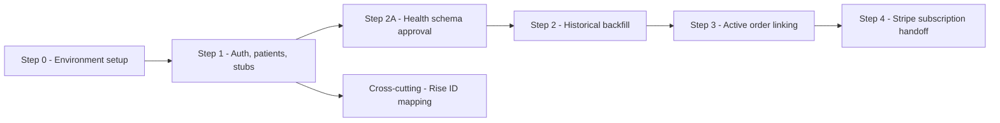
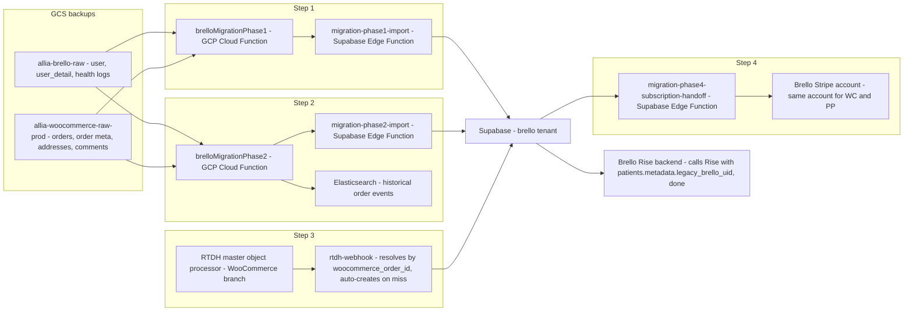
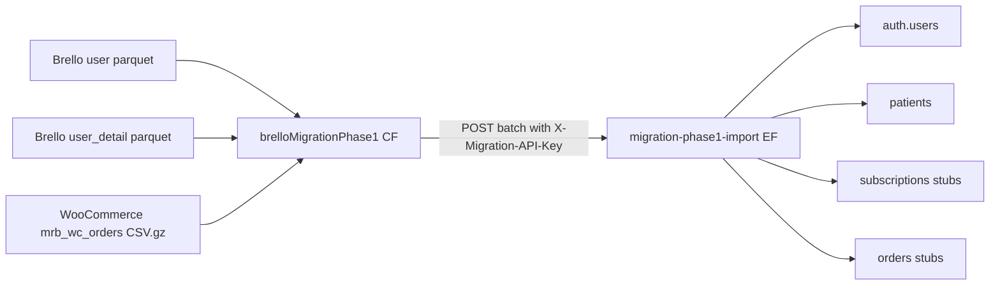

# Brello to Patient Platform Data Migration Plan

> Version: 4.8.0
> Last updated: 30 June 2026
> Owner: Rajesh Pandey
> Status: Steps 1 and 2 completed against the full Brello population in staging. Steps 3 and 4 code done and deployed. Step 4 blocked on WC billing handoff agreement and internal user decision.

This document is the current source of truth for the Brello to Patient Platform migration. Older diagrams and notes were consolidated into the two must-have diagrams under `docs/diagrams/`.

For ongoing handoff state, active blockers, commands run, and the copy-paste prompt for new Codex sessions, use `docs/migration-working-notes.md`.

## Current PR State

Open PRs as of 30 June 2026:

| Repository | PR | Description |
| ---------- | -- | ----------- |
| `rt-data-hub-functions` | https://github.com/Allia-Health/rt-data-hub-functions/pull/178 | Subscription renewal linkage + parent-order item fallback for product resolution |
| `patient-platform-admin` | https://github.com/Allia-Health/patient-platform-admin/pull/189 | Step 1 auto-creates Telegra links and order status history |

Recently merged:

| Repository | PR | Notes |
| ---------- | -- | ----- |
| `rt-data-hub-functions` | https://github.com/Allia-Health/rt-data-hub-functions/pull/175 | Phase 1 and 2 network resilience: timeout, retry, abort |
| `patient-platform-admin` | https://github.com/Allia-Health/patient-platform-admin/pull/180 | Phase 2 import concurrency fix + order_cancelled dispatch |
| `patient-platform-admin` | https://github.com/Allia-Health/patient-platform-admin/pull/181 | Populate orders.subscription_id during Phase 2 enrichment |

## Confirmed Migration Steps

| Step | Linear | Name | Scope | Approx effort senior engineer days | ETA date | Status |
| ---- | ------ | ---- | ----- | ---------------------------------- | -------- | ------ |
| 0 | PP-529 | Pre-Migration Environment Setup | Secrets, permissions, DB migration, staging smoke test | 0 |  | Done |
| 1 | PP-528 | Account + Empty Order Creation | Supabase Auth users, patient profiles, subscription stubs, order stubs | 2 |  | Done |
| 2A | PP-539 | Health Data Schema Approval & Mapping | Confirm PP table targets and schema gaps before health migration completion | 1 |  | Done |
| 2 | PP-530 | Past Order Backfill + Health Data Migration | GCS reader Cloud Function, Supabase ingest Edge Function, Elasticsearch historical writes | 6 |  | Done |
| 2B | PP-627 | Multi-product WooCommerce order handling | Handle orders with more than one distinct product line | 2 |  | In Progress (Miguel) |
| 3 | PP-531 | Active Order Integration | Link WooCommerce active orders to Supabase orders for RTDH production flow | 2 |  | Done |
| 4 | PP-532 | Same-Account Stripe Subscription Handoff | Create PP-managed Stripe subscriptions using existing Brello Stripe customers/payment methods, then block Woo renewals | 4 |  | Blocked |
| X | PP-540 | Brello Rise ID Mapping | Keep Brello Rise working after Firebase/Woo IDs become Supabase IDs | 1 |  | Done |



## Architecture Overview



## Data Sources

| Source | Bucket | Key tables/files | Notes |
| ------ | ------ | ---------------- | ----- |
| Brello PostgreSQL export | `gs://allia-brello-raw` | `user`, `user_detail`, `weight_log`, `medication_log`, `measurement_log`, `symptoms_log` | PII fields are AES-256-GCM encrypted with `enc::` prefix |
| WooCommerce MySQL export | `gs://allia-woocommerce-raw-prod` | `mrb_wc_orders`, `mrb_wc_orders_meta`, `mrb_wc_order_addresses`, `mrb_wc_order_addresses_contact`, `mrb_wc_order_operational_data`, `mrb_woocommerce_order_items`, `mrb_woocommerce_order_itemmeta`, `mrb_comments` | Orders and subscriptions are in `mrb_wc_orders` |
| Real-time events | RTDH | WooCommerce, Telegra, Lifefile, EasyPost events | Used for live/active order continuation after migration |

Confirmed approximate volumes:

| Dataset | Rows |
| ------- | ---- |
| Brello `user` | 62,804 |
| Brello `user_detail` | 62,804 |
| Brello `weight_log` | 331,653 |
| Brello `medication_log` | 293,232 |
| Brello `measurement_log` | 12,898 |
| Brello `symptoms_log` | 15,178 |
| WooCommerce `shop_order` | 361k |
| WooCommerce `shop_subscription` | 170k |

## Step 0: Pre-Migration Environment Setup

Required before executing Step 1:

- Create `BRELLO_CRYPTO_SECRET` in GCP Secret Manager for staging and production.
- Create `MIGRATION_API_KEY` in GCP Secret Manager for Cloud Function to Edge Function authentication.
- Deploy `migration-phase1-import` to Supabase staging.
- Apply `20260526120000_add_metadata_to_orders.sql` to staging.
- Set `SUPABASE_MIGRATION_FUNCTION_URL` in `brelloMigrationPhase1/function-staging.yaml`.
- Grant the Cloud Function service account read/list access to both GCS buckets.
- Run a dry-run smoke test with `dryRun=true&batchSize=5`.
- Confirm whether Brello status `schedule` is a data bug or intentional state.

## Step 1: Account + Empty Order Creation

Step 1 creates the minimum Patient Platform records needed to establish identity and order references before historical backfill.

### Implemented Components

| Repository | File | Purpose |
| ---------- | ---- | ------- |
| `rt-data-hub-functions` | `functions/brelloMigrationPhase1/src/index.js` | Reads GCS backups, decrypts Brello PII, transforms users/orders, sends batches to Supabase |
| `rt-data-hub-functions` | `functions/brelloMigrationPhase1/function-staging.yaml` | Cloud Function deployment config |
| `patient-platform-admin` | `supabase/functions/migration-phase1-import/index.ts` | Creates auth users, upserts patients, inserts order/subscription stubs |
| `patient-platform-admin` | `supabase/migrations/20260526120000_add_metadata_to_orders.sql` | Adds `orders.metadata` and metadata expression indexes for idempotency |

### Step 1 Flow



### Step 1 Auth Idempotency

The Edge Function must not rely on unsupported GoTrue REST filters. The current flow is:

1. Normalize email.
2. Check `patients` by `(tenant_id, email)`.
3. If a patient exists with `auth_user_id`, reuse it.
4. Otherwise create a Supabase Auth user with `email_confirm: true` and no password.
5. If auth creation reports an existing auth-only user, fall back to paginated `auth.admin.listUsers` and match normalized email.
6. Upsert `patients` on `(tenant_id, email)`.

### Step 1 Idempotency Keys

| Table | Key |
| ----- | --- |
| `patients` | `(tenant_id, email)` |
| `subscriptions` | `metadata->>'woo_subscription_id'` |
| `orders` | `metadata->>'woo_order_id'`, also `order_number = WOO-{id}` |

### Step 1 Scope

In scope:

- Supabase Auth user creation.
- Patient profile creation/update.
- Empty subscription stubs from WooCommerce `shop_subscription` rows.
- Empty order stubs from WooCommerce `shop_order` rows.
- Metadata bridge fields: `legacy_brello_uid`, `woo_id`, `telegra_id`, `is_migrated`, `migration_phase`.

Out of scope:

- Full order history.
- Stripe/payment handover.
- Telegra clinical records.
- Lifefile and EasyPost event details.
- Health logs.
- Brello Rise ID remapping.

## Step 2A: Health Data Schema Approval & Mapping

This approval task must happen before Step 2 health implementation. Patient Platform currently has specific domain tables rather than one generic consolidated health table.

| Brello source | Proposed Patient Platform target | Status |
| ------------- | -------------------------------- | ------ |
| `weight_log` | `patient_weight_entries` | Needs approval |
| `medication_log` | `medication_shot_intakes` | Needs medication and injection-site mapping approval |
| `symptoms_log.symptoms` | `patient_symptom_entries` | Needs approval |
| `symptoms_log.mood` | `patient_mood_change_entries` | Needs approval |
| `symptoms_log.activities` | `patient_activity_entries` | Needs approval |
| `measurement_log` | No confirmed target table | Schema gap |
| `symptoms_log.other` | No confirmed target table | Schema gap |

Decision owners: João Sobrinho and Alessandra. Raj owns the planning task and will update implementation tickets after approval.

## Step 2: Past Order Backfill + Health Data Migration

Step 2 now follows the same operating model as Step 1: one GCP Cloud Function reads and transforms backup data, and one Supabase Edge Function ingests into Supabase. This removes the Patient Platform consumer dependency from Step 2.

### Step 2 Order Backfill

The GCP Cloud Function should:

1. Read WooCommerce order metadata, addresses, contacts, operational data, line items, item metadata, and comments from GCS.
2. Read approved Brello health logs from GCS.
3. Transform records into batch payloads for a new Supabase ingestion Edge Function.
4. Push historical order event data directly into Elasticsearch using an ES client.
5. Support dry-run mode for transform and count validation.

The Supabase Edge Function should:

1. Validate the migration API key.
2. Resolve the `brello` tenant.
3. Match existing Supabase stubs by `metadata->>'woo_order_id'` and `metadata->>'woo_subscription_id'`.
4. Fill in full order/subscription details.
5. Insert/update approved health data.
6. Preserve source IDs and idempotency keys in metadata.
7. Return per-batch success and failure summaries.

Step 2 must not call the Patient Platform consumer and must not trigger Stripe capture, Telegra order creation, or patient notifications.

### Step 2 Health Migration

Health migration should use approved target tables only. All writes must be idempotent and traceable through metadata containing the source Brello row ID.

Health idempotency key:

```sql
tenant_id, patient_id, migration_source, migration_source_id, migration_source_item_key
```

Current health decision:

- `weight_log` maps to `patient_weight_entries`.
- `medication_log` maps to `medication_shot_intakes`.
- `symptoms_log.symptoms` maps to `patient_symptom_entries`.
- `symptoms_log.mood` maps to `patient_mood_change_entries`.
- `symptoms_log.activities` maps to `patient_activity_entries`.
- `measurement_log` maps to `patient_body_measurement_entries` for chest, waist, hips, and arms.
- `symptoms_log.other` needs a new target table or explicit deferral.

Open Step 2 mapping items:

- `wc-temporary-collect`, `auto-draft`, and blank WooCommerce status need confirmation from Jaime/João.
- Product/SKU mapping to Patient Platform products is still needed.
- Medication name/strength mapping is still needed.
- Injection-site mapping must use stable labels/names, not tenant-specific IDs.
- Elasticsearch alias and mapping names still need confirmation.

## Step 3: Active Order Integration

Active orders are orders not terminally completed/cancelled at migration time. The current plan is to rely on RTDH once it is live in production, because it should already be reading active order information.

Step 3 migration work is mainly identity/linking work:

1. Make sure active WooCommerce orders are linked to the corresponding Supabase orders.
2. Confirm which WooCommerce ID fields RTDH sends for active order events.
3. Store or expose the lookup needed for the Supabase consumer to identify the order.
4. Validate that active-order events update the correct Supabase order.
5. Add reconciliation or retry behavior for events that cannot be linked.

Step 3 should not duplicate RTDH's production ingestion path.

Step 3 is now validated end to end in staging against a real WooCommerce order (Mariana's order 757687), not just a synthetic Pub/Sub event. Five bugs surfaced and were fixed along the way:

1. WooCommerce idempotency keyed only on the order id, which never changes, so an order's first status change permanently blocked every later status change for that same order. Fixed by appending WooCommerce's own `date_modified_gmt` to the idempotency key.
2. The merger suppressed the outbound Patient Platform webhook for any WooCommerce order without `ids.patient_platform_order_id` yet, on the assumption a later `order.linked` event would carry the accumulated state forward. That assumption does not hold for orders Step 1/2 never imported, since there is no guaranteed later linking event for them. Removed the suppression for the WooCommerce branch.
3. `MASTER_OBJECT_WEBHOOK_URL` and `MASTER_OBJECT_WEBHOOK_SECRET` were never actually set on either staging master object processor function, so the outbound webhook had been silently no-op-ing since Step 3 was first deployed. Wired both, reusing the existing `migration-api-key` secret (already shared between RTDH and Patient Platform) instead of provisioning a new one.
4. The webhook URL was missing the `/event` path segment. This looked like a Supabase platform routing failure (plain 404) until the function's own boot logs showed it was alive and just rejecting the unmatched path.
5. `customer.email` was read from `payload.raw_payload.billing.email`, but the real WooCommerce order payload has `billing.email` as a top-level field, not nested under `raw_payload` — the same shape mismatch as the idempotency fix above. `rtdh-webhook` rejected the payload outright until this was fixed.

Also found along the way: `rtdh-webhook`'s event-type allowlist never included `order_cancelled`, so any WooCommerce cancellation would have been rejected. Added it; the rest of the WooCommerce status map (`payment_pending`, `payment_collected`, `payment_failed`, `order_sent_to_pharmacy`, `delivered`) was already covered.

Confirmed by replaying the real master document straight at `rtdh-webhook` with the `order_cancelled` fix live: `200 {"received":true,...,"eventType":"order_cancelled"}`.

Step 3 also picked up an auto-create path on the Patient Platform side for orders Step 1/2 never imported: when `rtdh-webhook` cannot find an existing order by `woocommerce_order_id`, it now creates the order stub itself from the WooCommerce payload and customer id instead of dropping the event.

This was a single real order for a single customer, not a cohort-scale test. Broader validation across more order/product types is still worth doing before relying on this path for the full migration.

## Step 4: Same-Account Stripe Subscription Handoff

For the first production path, Brello WC to Brello PP, the team is planning to use the same Brello Stripe account. In that setup, existing Stripe customers and saved payment methods can be reused because they stay inside the same Stripe account.

That means the Stripe Billing Migration Toolkit is no longer the preferred path for Brello WC to Brello PP. A scoped API-based handoff is a better fit because it can update Supabase, coordinate WooCommerce renewal blocking, and return row-level results for retries.

Primary Brello WC to Brello PP path:

1. Accept a scoped list of emails for each Step 4 batch.
2. Resolve each email to Patient Platform patient, Woo customer, Woo subscription, Supabase subscription, and old Brello Stripe customer id.
3. Verify the Stripe customer exists in the Brello Stripe account.
4. Verify the customer has a reusable saved payment method.
5. Create a new Stripe Billing subscription through Stripe APIs using the existing Stripe customer id.
6. Use a PP recurring Stripe price id when one is provided, otherwise use inline Stripe `price_data` from the PP product amount and interval.
7. Set the billing anchor to the Woo next payment date and disable proration.
8. Store the new Stripe subscription id in Supabase and mark the migrated subscription as PP-managed.
9. Block, pause, or mark the WooCommerce subscription as migrated so Woo does not renew it again.
10. Return per-row success/failure details so the batch can be safely rerun.

Double-charge prevention is the main Step 4 risk. PP must not start charging while WooCommerce can still renew the same subscription.

Current implementation status:

- `migration-phase4-subscription-handoff` has been added as the dry-run-first Supabase Edge Function for this path.
- The function is deployed to staging.
- Dry-run validation is blocked because Raj does not have Secret Manager version access for `migration-api-key`.
- The function can be tested as soon as someone with the key runs the scoped request or grants Raj access to read the secret.

Recurring Stripe price handling:

- A Stripe Billing subscription still needs recurring price data.
- For Step 4 testing, the migration function can use inline Stripe `price_data` from the PP product amount and interval, so pre-created three-month price ids are not a hard blocker.
- If a PP product has Stripe product/price ids configured, the function can use those instead.
- Monthly subscriptions still need matching monthly PP products or those rows should remain blocked.
- Stripe subscription metadata should identify PP-created billing so it can be distinguished from Woo-created billing.

Cross-account path:

- CareLink and any later cross-account migration are separate.
- Saved payment methods cannot be copied between separate Stripe accounts.
- Cross-account batches need destination customers and saved payment methods before subscription import.
- The Stripe Billing Migration Toolkit remains useful for those later cross-account or CSV-driven migrations.

Sandbox and production Stripe objects are separate. Sandbox can validate behavior only with sandbox customers, prices, payment methods, and subscriptions.

## Cross-Cutting: Brello Rise ID Mapping

Done (PP-540, 10 June 2026). Brello Rise continues serving both the legacy Brello app and Patient Platform unchanged.

Decision: keep Rise IDs as they are. Do not rewrite Rise IDs during migration, and do not call Rise with the new Supabase `auth.users.id` or `patients.id` for migrated Brello users.

| Context | ID to use |
| ------- | --------- |
| Legacy Brello app | existing Rise user id |
| Migrated Patient Platform user | `patients.metadata.legacy_brello_uid` |
| Supabase auth user id | not used for Rise calls |
| Supabase patient id | not used for Rise calls |
| WooCommerce customer id | kept in metadata only, not used for Rise calls |

Why: `fitness_user.id` is Rise's canonical user id, and Rise routes use whatever id is passed directly, creating a new user if it doesn't recognize one. Swapping in Supabase ids would create duplicate Rise users and lose continuity with existing Rise history.

No Rise DB rewrite and no dual-id lookup are needed. Step 1 already stores the legacy Brello user id in `patients.metadata.legacy_brello_uid`; Step 2 preserves it. Any Patient Platform call into Rise for a migrated user resolves `rise_user_id = patients.metadata.legacy_brello_uid`. New, non-migrated Patient Platform users keep the normal Patient Platform Rise id strategy.

## Patient Profile Mapping

| Source | Target | Notes |
| ------ | ------ | ----- |
| `user.email` | `auth.users.email`, `patients.email` | Normalized lowercase |
| `user.first_name` | `patients.first_name` | Decrypt `enc::` |
| `user.last_name` | `patients.last_name` | Decrypt `enc::` |
| `user.phone` | `patients.phone` | Decrypt `enc::` |
| `user_detail.dob` | `patients.date_of_birth` | Nullable |
| `user_detail.billing_address` | `patients.address_line1`, `address_line2`, `city`, `state`, `postal_code`, `country` | Decrypt JSON |
| `user_detail.start_weight` | `patients.starting_weight` | Nullable |
| `user_detail.goal_weight` | `patients.target_weight` | Nullable |
| `user.uid` | `patients.metadata.legacy_brello_uid` | Audit bridge |
| `user.woo_id` | `patients.metadata.woo_id` | WooCommerce bridge |
| `user.telegra_id` | `patients.metadata.telegra_id` | Telegra bridge |
| `user_detail.gender` | `patients.metadata.gender` | No first-class column confirmed |
| `user_detail.weight_unit` | `patients.metadata.preferred_weight_unit` | No first-class column confirmed |
| `user_detail.measurement_unit` | `patients.metadata.preferred_measurement_unit` | No first-class column confirmed |

## WooCommerce Status Mapping

Terminal historical order statuses are inserted directly into Supabase without lifecycle events. Active statuses are used for Step 3 RTDH linking once RTDH is live in production.

| WooCommerce status | Patient Platform status key | Category |
| ------------------ | --------------------------- | -------- |
| `wc-completed` | `delivered` | Terminal |
| `wc-cancelled` | `order_cancelled` | Terminal |
| `wc-failed` | `payment_failed` | Terminal |
| `wc-refunded` | `order_cancelled` | Terminal |
| `wc-pending` | `payment_pending` | Active |
| `wc-on-hold` | `payment_pending` | Active |
| `wc-processing` | `payment_collected` | Active |
| `wc-send_to_telegra` | `order_sent_to_pharmacy` | Active |
| `wc-provider_review` | `provider_review_pending` | Active |
| `wc-admin_review` | `provider_review_pending` | Active |
| `wc-collect_payment` | `payment_pending` | Active |
| `wc-prerequisites` | `payment_collected` | Active |
| `wc-waiting_room` | `payment_collected` | Active |
| `wc-error_review` | `provider_review_pending` | Active |
| `wc-pending-cancel` | `order_pending_cancellation` | Active |
| `cancel_cus_req` | `order_cancelled` | Terminal |
| `cancel_pat_rej` | `order_cancelled` | Terminal |

Unresolved statuses:

- `wc-temporary-collect`
- `auto-draft`
- blank status

João suggested asking Jaime what these mean before adding a final mapping.

## Open Blockers

| Blocker | Owner | Required before |
| ------- | ----- | --------------- |
| Unmapped WC statuses: `wc-temporary-collect`, `auto-draft`, blank | Miguel / Jaime / João | Step 2 status mapping |
| `symptoms_log.other` target or explicit deferral | João / Alessandra | Step 2 health completion |
| Product/SKU mapping to Patient Platform products | Raj / João / Miguel | Step 2 and Step 3 |
| Medication and injection-site mapping | Raj / João | Step 2 health completion |
| Elasticsearch aliases and mappings | Raj / Umar / João | Step 2 ES writes |
| Cohort-scale Step 3 validation beyond the single real-order test | Raj | Step 3 cutover |
| PP Stripe products/prices and WooCommerce renewal-blocking mechanism | Raj / João / Miguel / Alessandra / Mariana | Step 4 |

## Verification Checklist

Step 1:

- Run Cloud Function dry-run with `batchSize=5`.
- Confirm decrypted PII has no `enc::` prefix before posting to Supabase.
- Deploy Edge Function to staging.
- Run synthetic batch covering active, onboard, scheduled_for_deletion, pending_deletion, and schedule statuses.
- Re-run the same batch and confirm no duplicate patients, subscriptions, or orders.
- Confirm order status IDs resolve through `order_statuses.status_key`.
- Confirm metadata indexes support idempotency filters.

Step 2:

- Confirm Step 2 GCP reader function dry-run counts and sample payloads.
- Confirm Step 2 Supabase Edge Function ingests a small batch idempotently.
- Confirm direct Elasticsearch index alias and mapping.
- Confirm historical imports do not trigger Stripe, Telegra, notifications, or PP consumer flows.
- Confirm health imports use the shared migration idempotency key.

Step 3:

- Confirm RTDH production payload includes the WooCommerce IDs needed for lookup. Done — confirmed against a real order payload on 26 June 2026.
- Confirm Supabase can link RTDH active-order events to migrated orders. Done for the auto-create path; an order Step 1/2 never imported is now created on first active-order event instead of dropped.
- Verify active-order updates land on the correct Supabase order. Done for one real order across five distinct status transitions.
- Verify reconciliation behavior for unlinked active-order events. Still open at cohort scale — only one order has been exercised so far.

Step 4:

- Confirm PP-specific Stripe products and recurring prices in the Brello Stripe account.
- Confirm first email-list batch.
- Verify existing Brello Stripe customers have reusable saved payment methods.
- Run a small internal/test-customer subscription handoff.
- Verify PP subscription IDs, billing anchor, and payment method behavior.
- Verify no double charge during cutover.

## Related Diagrams

- `docs/diagrams/01-system-architecture.mmd`
- `docs/diagrams/10-woocommerce-patient-platform-migration.mmd`
