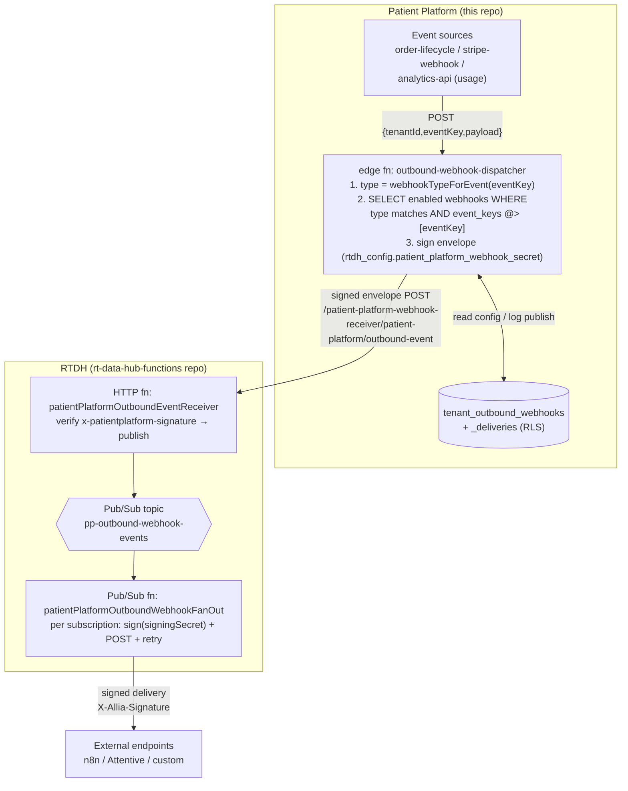

# Outbound Webhooks

Tenants can forward selected platform events to an external endpoint (n8n,
Attentive, automation/marketing engines). This document describes the data model,
the event catalog, the dispatcher, and the security model.

## Two webhook types (never mixed)

Every webhook has a fixed **type**, and its subscribable events are scoped to
that type. A single webhook cannot mix event types.

| Type | Source | Example events |
|---|---|---|
| `lifecycle` | order / subscription / provider lifecycle | `order.paid`, `provider.approved`, `order.delivered`, `subscription.cancelled` |
| `product_usage` | analytics / usage events from the patient app | `usage.page_view`, `usage.login`, `usage.checkout_completed`, `usage.activity_event` |

`product_usage` includes **named behavioral events** — one `usage.<name>` key per
`analytics.track()` call site in the patient UI (`usage.login`,
`usage.signup_started/completed`, `usage.product_viewed`,
`usage.checkout_started/completed`, `usage.questionnaire_started/
step_completed/completed`) — so a subscriber can pick exactly the events they
want instead of filtering `usage.activity_event`. `usage.session_started/ended`
and `usage.utm_attribution` were REMOVED (2026-07): the SDK never emits session
events and UTM is a session property, not an event — offering them created
webhooks that could never fire.

The canonical catalog lives in two places kept in sync:

- Frontend: `src/lib/webhook-events.ts` (`WEBHOOK_EVENT_CATALOG`, `eventsAreValidForType`).
- Dispatcher: `supabase/functions/outbound-webhook-dispatcher/helpers.ts` (`EVENT_TYPE`,
  `webhookTypeForEvent`, `eventsAreValidForType`).

> When adding an event, update **both** files (and the test catalog).

## Data model

Migration: `supabase/migrations/20260623120001_create_tenant_outbound_webhooks.sql`

### `tenant_outbound_webhooks`
| Column | Notes |
|---|---|
| `id` | uuid pk |
| `tenant_id` | FK → tenants, ON DELETE CASCADE |
| `name` | display name |
| `webhook_type` | `'lifecycle' \| 'product_usage'` (CHECK) — fixed per row |
| `target_url` | endpoint that receives the POST |
| `signing_secret` | per-endpoint HMAC secret (shown in UI; regenerate on create) |
| `event_keys` | `text[]` — must all belong to `webhook_type`'s catalog |
| `is_enabled` | toggle |
| `created_at` / `updated_at` / `created_by` | audit |

### `tenant_outbound_webhook_deliveries`
Recent delivery log (event_key, status_code, success, attempts, error, created_at)
used by the UI and for debugging.

### RLS
Tenant admins manage their own tenant's rows via
`public.is_tenant_admin(auth.uid(), tenant_id)`. The dispatcher runs with the
service role.

## Architecture (delivery via RTDH → Pub/Sub — Option B)

Events are delivered **PP → RTDH → Pub/Sub → external endpoint**, not POSTed
directly from the platform. RTDH owns the topic, fan-out, per-endpoint retries.

### Hop 0 — producers → dispatcher

Something has to **call** the dispatcher, or nothing is ever delivered. Two
producers cover the two webhook types:

- **`product_usage` (usage.\*)** — emitted **inline** from `analytics-api` when a
  batch of analytics events is accepted. One outbound event per distinct usage
  KEY in the batch: named behavioral events map first
  (`event_name login → usage.login`, `checkout_completed →
  usage.checkout_completed`, … via `USAGE_NAME_TO_EVENT`), then event types
  (`page_view → usage.page_view`), everything else → `usage.activity_event`.
  Fires even for anonymous sessions. Helper: `_shared/outbound-emit.ts` →
  `emitOutboundEvent` / `outboundEventForUsageName` / `outboundEventForUsageType`.

- **`lifecycle` (order.\*/provider.\*/subscription.\*)** — produced by the
  cron-invoked **`outbound-webhook-sweeper`** edge function, NOT by inline emits
  in order-lifecycle. Order status changes are written at ~20 sites across
  order-lifecycle (no central advance function) and this project has **no
  pg_net**, so a DB trigger can't call an edge function. The sweeper instead
  reads *committed* `order_status_history` + `subscription_events` rows since a
  per-source watermark (`outbound_event_sweep_state`) and forwards each to the
  dispatcher. This guarantees **every** transition fans out regardless of which
  code path wrote it. Status→event mapping lives in `_shared/outbound-emit.ts`
  (`STATUS_KEY_TO_EVENT`); unmapped internal statuses are intentionally skipped.
  Latency = cron cadence.

> The sweeper is independent of the Communications Automations sweep
> (`comms-scheduler`): its own watermark table, no comms coupling, so Outbound
> Webhooks work even where comms isn't provisioned.

### Hop 1 — PP dispatcher → RTDH

Edge function: `supabase/functions/outbound-webhook-dispatcher`.
Request (service-to-service): `POST { tenantId, eventKey, payload }`.

1. Derive the event's **type** from `eventKey` (`webhookTypeForEvent`). Unknown → 400.
2. Select enabled webhooks for the tenant **of the matching type** that subscribe
   to `eventKey` (`webhook_type = type AND event_keys @> [eventKey]`). Types are
   never mixed. No matches → `{ published:false, matched:0 }`.
3. Build ONE **envelope** and POST it (signed) to RTDH at
   `${RTDH_BASE_URL}/patient-platform-webhook-receiver/patient-platform/outbound-event`:
   - Envelope: `{ event, type, tenantId, occurredAt, data, subscriptions:[{webhookId, targetUrl, signingSecret}] }`
   - Signed with `rtdh_config.patient_platform_webhook_secret` via `postSignedRtdhJson`
     (header `x-patientplatform-signature`) — the same emit pattern as
     `order-lifecycle`.
4. Record one delivery row per matched webhook with the **publish-to-RTDH** result.
   (The final HTTP delivery result is recorded RTDH-side.)

### Hop 2 — RTDH receiver + fan-out (rt-data-hub-functions repo)

Branch: `elianomarques/outbound-webhooks-fanout`.

- **`patientPlatformOutboundEventReceiver`** (HTTP): verifies
  `x-patientplatform-signature` against the shared
  `rtdh_config.patient_platform_webhook_secret`, then
  publishes the envelope to the **`pp-outbound-webhook-events`** Pub/Sub topic.
- **`patientPlatformOutboundWebhookFanOut`** (Pub/Sub): for each subscription,
  POSTs the public delivery body to `targetUrl` signed per-endpoint with that
  subscription's `signingSecret`, with bounded retries (3 attempts; retry on
  5xx/429, give up on other 4xx). The `signingSecret` is **never** forwarded —
  only the derived signature.

### Delivery payload & signature (to the external endpoint)

Body: `{ event, type, tenantId, occurredAt, data }` (no secrets, no other subs).
Headers:
- `X-Allia-Event`: the event key
- `X-Allia-Webhook-Type`: `lifecycle | product_usage`
- `X-Allia-Signature`: `t=<occurredAt>,sha256=<hmac>` — HMAC-SHA256 of the body
  using that webhook's `signing_secret`. Consumers verify by recomputing the HMAC.

### Payload enrichment (id → human-readable)

Producers emit raw ids (`patient_id`, `order_id`, `status_key`, `subscription_id`).
The **dispatcher enriches** the payload before publishing so a consumer can act on
the event without calling back to look ids up — e.g. to email a patient who just
ordered, you get `patient_email` directly.

Enrichment happens once, centrally, in
`outbound-webhook-dispatcher/enrich.ts` (the dispatcher is the single place that
sees every event and already holds a service-role client). Resolution, all
tenant-scoped except the platform `order_statuses` catalog:

| From | Derived fields added to `data` |
| --- | --- |
| `patient_id` | `patient_first_name`, `patient_last_name`, `patient_full_name`, `patient_email`, `patient_phone` |
| `order_id` | `order_status` (patient-facing label), `status_key`, `product_name` (+ patient via the order) |
| `status_key` | `status_label` (human-readable, from `order_statuses.admin_status_label`) |
| `subscription_id` | `subscription_status`, `product_name`, `current_period_end_at` (+ patient via the subscription) |

**Schema note (2026-07 fix):** order status is a relation
(`orders.status_id → order_statuses`), not a column — the lookup embeds
`order_statuses!orders_status_id_fkey` and flattens to `order_status` +
`status_key`. The previous select named phantom columns
(`status`, `provider_name`, `pharmacy_name`, `patient_name`), 42703'd on every
call, and — with errors swallowed — order webhooks silently shipped without
these fields. Lookup errors are now logged; test fakes mirror the real select
shape. `provider_name` / `pharmacy_name` are NOT delivered (they need the
provider/pharmacy link tables) — re-add to the catalog only when implemented.

Rules:
- **Best-effort**: a lookup miss (or a DB error) omits that field and never fails
  the dispatch. Enrichment is wrapped so it can't break the originating operation.
- **Never overwrites** a value the producer already supplied.
- **All fields are delivered** on every subscribed webhook. Contact fields
  (`patient_email`, `patient_phone`, names) ARE included — endpoints are
  tenant-configured and already receive `patient_id`. The catalog marks these
  `pii: true` and the UI badges them.
- The field catalog (ids + derived, with `source`/`pii`) is
  `src/lib/webhook-events.ts` — the single source of truth for the UI and this doc.

**Deferred:** per-webhook *selection* of which fields to deliver. It needs a
per-subscription payload in the RTDH fan-out envelope (today the envelope carries
one shared `data` for all subscriptions), so it was intentionally left out to
avoid a coordinated RTDH change. The catalog metadata (`source`, `pii`) is already
in place for when that UI is built.

## Tests

- PP: `supabase/functions/outbound-webhook-dispatcher/helpers.test.ts` — event→type
  routing, the no-mixing rule, unknown-event rejection, envelope shape.
  `enrich.test.ts` — id→human-readable resolution, no-overwrite, best-effort
  miss/error handling. Run: `cd supabase/functions && deno test --allow-env --allow-net`.
- RTDH: `tests/patientPlatformOutboundEventReceiver.test.js` (signature verify +
  publish) and `tests/patientPlatformOutboundWebhookFanOut.test.js` (per-endpoint
  signing, fan-out, retry policy). Run: `npx jest` in the RTDH repo.

## UI

`src/pages/tenant-admin/settings-v2/WebhooksReal.tsx` — real CRUD: create (type
first → type-scoped event checkboxes), enable/disable, delete, recent deliveries.
Surfaced under **Settings → API Keys & Webhooks → Outbound Webhooks**. (API Keys
and Data API on that page are **Coming soon**.)

## Deployment / config checklist

- PP: register both `outbound-webhook-dispatcher` and `outbound-webhook-sweeper`
  in `supabase/config.toml` (done) so the Supabase GitHub integration deploys
  them — a function missing from config.toml never deploys.
- PP: apply migration `…_outbound_event_sweep_watermark.sql` (creates
  `outbound_event_sweep_state`, seeded at `now()` so the first tick doesn't
  replay history).
- PP: schedule the sweeper. Migration
  `…_outbound_webhook_sweeper_cron.sql` enables `pg_net` and schedules a
  per-minute `pg_cron` job that POSTs `…/functions/v1/outbound-webhook-sweeper`
  with `Authorization: Bearer <CRON_SECRET>`. The job reads its config from
  **Vault** (not hardcoded), so it is environment-agnostic. Per environment,
  provision once (the job no-ops until these exist — no errors):
  - Set `CRON_SECRET` on the functions env.
  - `SELECT vault.create_secret('https://<ref>.supabase.co', 'project_url');`
  - `SELECT vault.create_secret('<CRON_SECRET>', 'outbound_sweeper_cron_secret');`

  Dev (`sunzxjnbgtknqeivljtd`) is already provisioned: pg_net enabled,
  `CRON_SECRET` set, both Vault secrets seeded. Staging/prod still need it.
- PP: `platform_settings.rtdh_config` or Supabase secrets must provide
  `RTDH_BASE_URL`; `platform_settings.rtdh_config` must provide
  `patient_platform_webhook_secret`. The RTDH receiver path is fixed in code as
  `/patient-platform-webhook-receiver`. Legacy database `api_url` +
  `consumer_secret` values are still accepted during rollout.
- RTDH: create the `pp-outbound-webhook-events` Pub/Sub topic; deploy both
  functions (dev/staging/prod YAML included); the fan-out function needs `all`
  egress (reaches arbitrary external endpoints); RTDH's receiver secret must
  match Patient Platform's configured `patient_platform_webhook_secret`.
