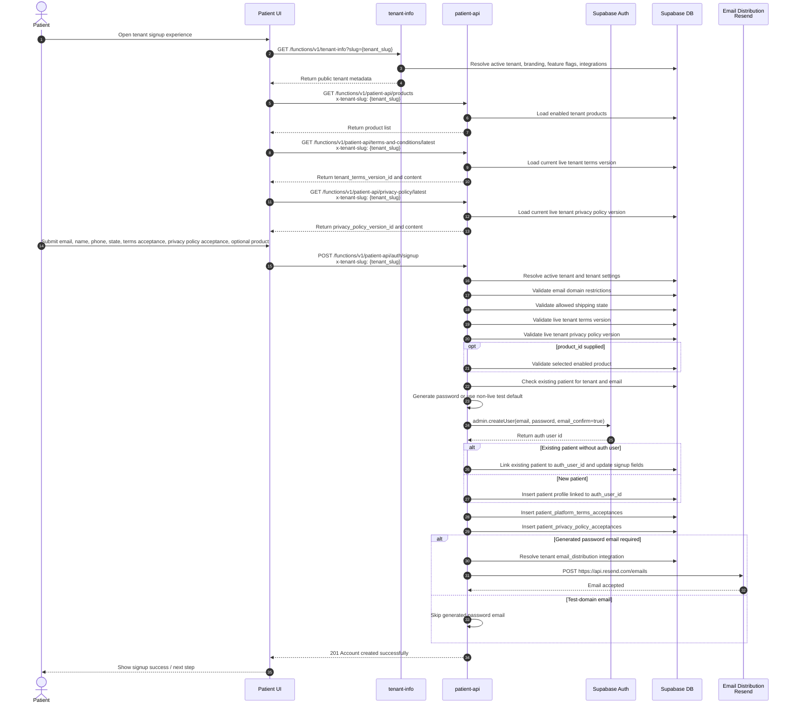
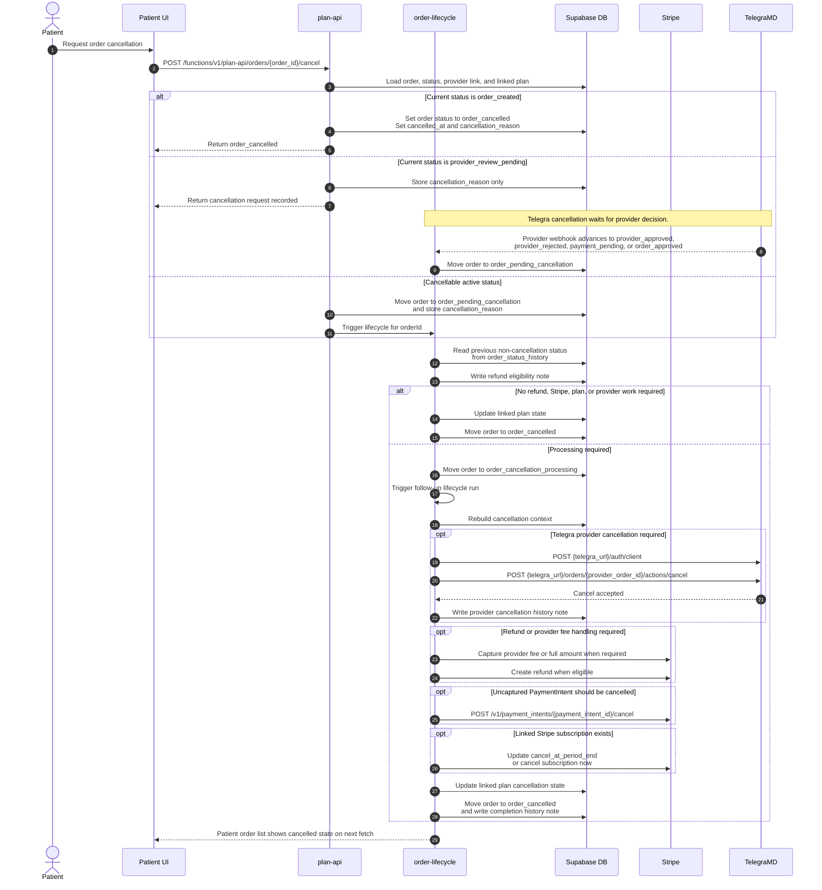
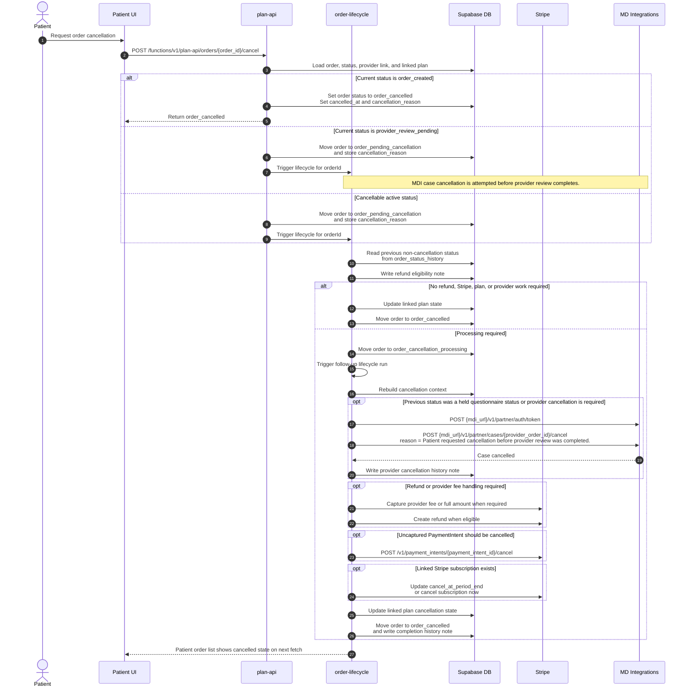

# Sequence Diagrams

This document shows end-to-end flows across the patient application, Supabase
Edge Functions, Stripe, RTDH, provider platforms, and pharmacy fulfillment
systems.

## Patient Sign Up Flow

> **Auth methods:** returning patients can sign in with email + password,
> **passwordless email OTP**, **Google** (Apple later), or a **passkey /
> biometric**. Endpoint details:
> [PatientAPI.md → Authentication](./PatientAPI.md#authentication).
> Dashboard/cloud setup: [AuthMethodsSetup.md](./AuthMethodsSetup.md).
>
> **Account setup + email verification moved post-payment (PP-566).** Account
> access (password/passkey) and **email verification** now happen in a dedicated
> checkout step **right after payment, before the questionnaires** (not in the
> later Provider Update step). The order lifecycle **holds the order at
> `shipping_details_required` until `patients.email_verified_at` is set**, so the
> provider managing the questionnaires always receives a validated email. The
> patient can correct email/phone there (`POST /auth/contact/update`) and
> re-verify; after verifying, the UI calls `POST /plan-api/orders/{id}/resume`.
> Email verification reuses the OTP (`/auth/otp/verify` stamps `email_verified_at`).



## Order Flow Sequence

The exact next status after each internal transition is controlled by
`order_statuses.next_status_id` and `display_order`. The diagram calls out the
status keys used by the code where the transition is explicit.

## Simplified Flow

This version hides internal Supabase database reads/writes and focuses on the
systems involved in the order journey.

> **Checkout model (PP-566):** the current flow uses an **embedded Stripe Elements
> PaymentIntent** (Option 2 signup), shown below. It replaced the legacy **hosted
> Checkout Session** redirect (`POST /plan-api/orders/{product_id}/checkout` →
> `POST /v1/checkout/sessions` → redirect → `checkout.session.completed`). The
> hosted route still exists for authenticated patients, but new guest signups use
> the PaymentIntent path. The two differ in the Stripe event that confirms payment:
> hosted emits `checkout.session.completed`; embedded uses **manual capture**, so
> the patient's confirmation emits `payment_intent.amount_capturable_updated`
> (authorization) and `payment_intent.succeeded` only fires later, when
> `order-lifecycle` captures at `payment_pending`. The order status still waits
> for RTDH to call `rtdh-webhook` with `global_status = payment_collected`. See
> `StripeIntegrationRequirements.md` and the RTDH `docs/stripe/stripe-event-pipeline.md`.
>
> **Subscription parity (PP-566) — code-complete, pending deploy/verify.** The
> embedded flow now creates a Stripe **Customer** (Phase A), a Stripe
> **Subscription** at payment capture (Phase B), and collects a **card via
> SetupIntent for $0/100%-off** subscriptions (Phase C) — restoring renewals,
> payment-failed retry, billing portal, and subscription cancellation for the
> embedded path (the hosted path is unchanged). The simplified diagram below shows
> the order→questionnaire path; subscription setup happens at capture
> (`order-lifecycle` → `ensureSubscriptionForCapturedOrder`) and, for $0 subs,
> after the SetupIntent completes (`POST /orders/{id}/setup-complete`). See the
> "Embedded ↔ hosted subscription parity" section in `StripeIntegrationRequirements.md`.

```mermaid
sequenceDiagram
    autonumber

    actor Patient
    participant UI as Patient UI
    participant Platform as Patient Platform<br/>Supabase Edge Functions
    participant RTDH as RTDH
    participant Stripe as Stripe
    participant Provider as Provider Platform<br/>TelegraMD / MDI
    participant Pharmacy as Pharmacy / LifeFile
    participant Shipping as Shipping Platform<br/>EasyPost
    participant Jotform as Jotform

    Patient->>UI: Select product and start checkout (embedded Elements)
    UI->>Platform: POST /functions/v1/plan-api/orders/{product_id}/payment-intent
    Note over Platform: Create order (order_created) + link order_payment_provider_transactions<br/>by provider_payment_intent_id; stamp metadata.patient_platform_order_id
    Platform->>Stripe: POST /v1/payment_intents (capture_method=manual)
    Stripe-->>Platform: Return client_secret + payment_intent_id
    Platform-->>UI: Return client_secret + order_id

    par Create-order linking (independent of Stripe callback)
        Platform->>RTDH: POST {rtdh_config.api_url}/create-order<br/>payment_intent_id = {pi} (no checkout_session_id in embedded flow)
        Note over RTDH: RTDH links master object by payment_intent_id →<br/>writes stripe_payment_intent_id identity link
        RTDH-->>Platform: POST /functions/v1/rtdh-webhook/event<br/>global_status = order.linked
    end

    UI->>Stripe: Confirm PaymentIntent on embedded PaymentElement
    Patient->>Stripe: Complete payment (authorize)
    Stripe->>RTDH: payment_intent.amount_capturable_updated → RTDH Stripe receiver
    Note over RTDH: PLANNED (PP-566): RTDH resolves order by payment_intent_id and<br/>RECORDS the authorization (no order-status push — order already advanced via order.linked)

    Note over Platform: Internal reprocessing uses GET /functions/v1/order-lifecycle?orderId={order_id}

    Platform-->>Platform: Order moved to shipping_details_required (Shipping Address)

    alt Shipping or billing details are incomplete
        UI->>Platform: PATCH /orders/{order_id}/address
    end

    Platform-->>Platform: Order moved to provider_order_creation_pending status

    alt TelegraMD selected
        Platform->>Provider: POST {telegra_url}/auth/client
        Platform->>Provider: POST {telegra_url}/orders
        Provider-->>Platform: Return provider_order_id
        Provider->>RTDH: Telegra order_created event
    else MD Integrations selected
        Platform->>Provider: POST {mdi_url}/v1/partner/auth/token
        Platform->>Provider: POST {mdi_url}/v1/partner/patients<br/>create user if not exists
        Provider->>RTDH: webhook event_type = patient_created
        Platform->>Provider: POST {mdi_url}/v1/partner/cases<br/>is_additional_approval_needed = true<br/>hold_status = true
        Provider->>RTDH: webhook event_type = case_created
        Provider-->>Platform: Return case id as provider_order_id
    end

    Platform->>RTDH: POST {rtdh_config.api_url}/provider-platform/new-order
    RTDH-->>Platform: POST /functions/v1/rtdh-webhook/event<br/>global_status = order.fulfillment_linked

    Platform-->>Platform: Order moved to patient_questionnaire_pending status
    UI->>Platform: GET /functions/v1/provider-platform-bridge/get-patient-questionnaire/{order_id}

    alt TelegraMD questionnaire
        Platform->>Provider: GET {telegra_url}/products/actions/getConditionsAndSymptoms
        Provider-->>Platform: Return questionnaire
        Platform-->>UI: Return questionnaire
        Patient->>UI: Submit Patient Questionnaire
        UI-->Platform: Save Patient Questionnaire on POST /functions/v1/provider-platform-bridge/get-patient-questionnaire/{order_id}
        Platform->>Provider: PUT {telegra_url}/patients/{provider_patient_id}
    else MDI questionnaire (embedded Jotform)
        Platform-->>UI: Return embedded Jotform URL with query params<br/>provider_key=md_integrations<br/>patient_platform_order_id={order_id}
        UI->>Jotform: Load embedded patient questionnaire
        Jotform-->>UI: Return patient questionnaire
        Patient->>Jotform: Fill and submit patient questionnaire
        Jotform->>RTDH: webhook event_type = submission.created<br/>submission_id
        RTDH-->>Platform: POST /functions/v1/rtdh-webhook/event<br/>global_status = patient_questionnaire_submitted
        Platform->>Jotform: GET submission by submission_id
        Jotform-->Platform: Returns answers and files (ID file)
        Platform->>Provider: Upload ID file when present
        Platform->>Provider: PATCH {mdi_url}/v1/partner/patients/{provider_patient_id}<br/>including driver_license_id + mapped fields
    end

    Platform-->>Platform: On success, move order to medical_questionnaire_pending

    alt TelegraMD intake
        Patient->>UI: Submit medical intake
        UI->>Platform: POST /functions/v1/provider-platform-bridge/order/{order_id}/patient-profile<br/>or POST /functions/v1/provider-platform-bridge/order/{order_id}/questionnaire-answer-location
        Platform->>Provider: PUT {telegra_url}/patients/{provider_patient_id}<br/>POST {telegra_url}/questionnaireInstances/{id}/actions/answerLocation?shouldNavigateNext=true
    else MDI medical questionnaire (embedded Jotform)
        Platform-->>UI: Return embedded Jotform URL with query params<br/>provider_key=md_integrations<br/>patient_platform_order_id={order_id}
        UI->>Jotform: Load embedded medical questionnaire
        Jotform-->>UI: Return product medical questionnaire
        Patient->>Jotform: Fill and submit medical questionnaire
        Jotform->>RTDH: webhook event_type = submission.created<br/>submission_id
        RTDH-->>Platform: POST /functions/v1/rtdh-webhook/event<br/>global_status = medical_questionnaire_submitted
        Platform->>Jotform: GET submission by submission_id
        Jotform-->Platform: Returns answers and files (if any)
        Platform->>Provider: POST {mdi_url}/v1/partner/cases/{case_id}/questions
        Platform->>Provider: POST {mdi_url}/v1/partner/files + attach to case intake
        Platform->>Provider: PATCH {mdi_url}/v1/partner/cases/{case_id}/status<br/>hold_status = false (to allow move forward the case in MDI)
    end

    Note over Patient,UI: PP-566 Option 2 — Provider Update step.<br/>OPTIONAL "Set up account access" (AccountAccessSetup):<br/>set a password OR enrol a passkey/biometric.<br/>Patient is already authenticated (signup issued a session);<br/>they may skip and later sign in via OTP / Google / passkey.

    alt TelegraMD Provider Review
        Provider-->>Platform: Intake accepted
        Provider-->>RTDH: Event with: "eventType"= "new_status_set_to_request", targetEntity.status=requires_provider_review  
    else MDI Provider Review
        Provider-->>RTDH: event_type = case_assigned_to_clinician
    end
    
    RTDH-->>Platform: POST /functions/v1/rtdh-webhook/event<br/>global_status = provider_review_pending

    alt Prescription Approval process
        alt TelegraMD Approval process
            Provider-->>RTDH: Event with: "eventType"="prescription_approved_by_practitioner"  
            RTDH-->>Platform: POST /functions/v1/rtdh-webhook/event<br/>global_status = provider_approved
            Provider-->>RTDH: Event with "eventType"="new_status_set_to_request" and targetEntity.status=requires_order_processing    
            RTDH-->>Platform: POST /functions/v1/rtdh-webhook/event<br/>global_status = payment_pending
        else MDI Provider Approval process
            Provider-->>RTDH: event_type = case_approved
            RTDH-->>Platform: POST /functions/v1/rtdh-webhook/event<br/>global_status = provider_approved
            Platform->>Platform: rtdh-webhook triggers order-lifecycle
            Platform-->>Platform: Non-Telegra auto-advance provider_approved to payment_pending.
        end
    else Prescription Rejection process
        Provider-->>RTDH: Prescription Rejected
        RTDH-->>Platform: POST /functions/v1/rtdh-webhook/event<br/>global_status = provider_rejected
        Platform->>Platform: Trigger order-lifecycle for rejected order
        Platform->>Stripe: POST /v1/payment_intents/{payment_intent_id}/cancel<br/>when authorization is uncaptured
        Platform->>Platform: Record Stripe cancellation in order_status_history<br/>and move linked plan to cancelled
    end

    Platform->>Stripe: POST /v1/payment_intents/{payment_intent_id}/capture<br/>or GET /v1/payment_intents/{payment_intent_id}
    Note over Platform: Capture/pay paths persist payment metadata and paid_at,<br/>but do not set payment_collected locally.
    Stripe-->>RTDH: payment_intent.succeeded → RTDH Stripe receiver<br/>(capture fires succeeded; RTDH resolves by payment_intent_id)
    
    alt Payment Approval process
        RTDH-->>Platform: POST /functions/v1/rtdh-webhook/event<br/>global_status = payment_collected
    else Payment Rejection process
        RTDH-->>Platform: POST /functions/v1/rtdh-webhook/event<br/>global_status = payment_failed
        Note over Platform: Order moves to payment_failed.<br/>Patient is shown "Update Payment" CTA in patient UI.
        alt Patient retries with existing card (Retry Payment)
            Patient->>Platform: POST /functions/v1/plan-api/orders/{id}/retry-payment
            Platform->>Stripe: POST /v1/payment_intents/{pi_id}/confirm (off_session)
            Stripe-->>Platform: Payment confirmed
            Platform->>Platform: Move order payment_failed → payment_pending
            Platform->>Platform: Trigger order-lifecycle → capture payment
        else Patient updates payment method (Update Payment Method)
            Patient->>Stripe: Opens Stripe Billing Portal via<br/>POST /functions/v1/plan-api/orders/{id}/payment-portal
            Patient->>Stripe: Updates default payment method in portal
            Stripe-->>Platform: POST /functions/v1/stripe-webhook (customer.updated)
            Platform->>Stripe: POST /v1/payment_intents/{pi_id}/confirm (off_session, new method)
            Stripe-->>Platform: Payment confirmed
            Platform->>Platform: Move order payment_failed → payment_pending
            Platform->>Platform: Trigger order-lifecycle → capture payment
        end
    end

    Platform-->>Platform: Move order to order_approved status when payment collected.

    alt TelegraMD intake
        Platform->>Provider: POST {telegra_url}/orders/actions/sendToPharmacyRecipients
        Provider-->>Pharmacy: Send order to pharmacy
        Provider-->>RTDH: POST /functions/v1/telegra-webhook<br/>prescription_sent_to_pharmacy
        RTDH-->>Platform: POST /functions/v1/rtdh-webhook/event<br/>global_status = order_sent_to_pharmacy
    else MDI intake
        Platform->>Provider: POST {mdi_url}/v1/partner/cases/{case_id}/processing<br/>To authorize MDI to proceed to send to pharmacy
        Provider-->>RTDH: webhook event_type = offering_submitted
        RTDH-->>Platform: POST /functions/v1/rtdh-webhook/event<br/>global_status = order_sent_to_pharmacy 
    end

    Pharmacy-->>RTDH: POST /functions/v1/lifefile-webhook/event with rxStatus="Rx Scheduled"
    RTDH-->>Platform: POST /functions/v1/rtdh-webhook/event<br/>global_status = pharmacy_approval_pending

    Pharmacy-->>RTDH: POST /functions/v1/lifefile-webhook/event with rxStatus="Ready for Fulfillment"
    RTDH-->>Platform: POST /functions/v1/rtdh-webhook/event<br/>global_status = pharmacy_approved

    Pharmacy-->>RTDH: POST /functions/v1/lifefile-webhook/event with rxStatus="Fulfillment"
    RTDH-->>Platform: POST /functions/v1/rtdh-webhook/event<br/>global_status = ulfillment_in_progress

    Pharmacy-->>RTDH: POST /functions/v1/lifefile-webhook/event with rxStatus="Final verification"
    RTDH-->>Platform: POST /functions/v1/rtdh-webhook/event<br/>global_status = final_pharmacy_verification

    Pharmacy-->>Shipping: Shipping tag creation
    Shipping-->>Pharmacy: Returning Shipping Tag for order
    
    par Shipping Information from LifeFile

        Pharmacy-->>RTDH: POST /functions/v1/lifefile-webhook/event with rxStatus="Rx Shipping pickup"
        RTDH-->>Platform: POST /functions/v1/rtdh-webhook/event<br/>global_status = in_transit

    and Shipping Information from Provider
        alt TelegraMD as Provider
            Pharmacy-->>Provider: Returning Shipping Tag to Provider
            Provider-->>RTDH: POST /functions/v1/rtdh-webhook/event<br/>eventType = shipping_details_set
            RTDH-->>Platform: POST /functions/v1/rtdh-webhook/event<br/>global_status = in_transit
        end
    end
    
    Shipping-->>RTDH: POST /functions/v1/easypost-webhook/event
    alt EasyPost tracker delivered
        RTDH-->>Platform: POST /functions/v1/rtdh-webhook/event<br/>global_status = delivered
    else EasyPost tracker exception
        RTDH-->>Platform: POST /functions/v1/rtdh-webhook/event<br/>global_status = shipping_exception
    end
```

## Cancellation Sequence by Order Status

Patient-requested cancellations are handled through
`POST /functions/v1/plan-api/orders/{order_id}/cancel`. The endpoint persists
`orders.cancellation_reason`, then either cancels immediately for the earliest
order state or moves the order through the lifecycle-driven cancellation
statuses below.

| Current order status | Telegra cancellation behavior | MDI cancellation behavior |
| --- | --- | --- |
| `order_created` | `plan-api` can cancel directly to `order_cancelled`. | `plan-api` can cancel directly to `order_cancelled`. |
| `shipping_details_required` | Queue `order_pending_cancellation`; lifecycle may move directly to `order_cancelled` if no Stripe, refund, plan, or provider work is required. | Same as Telegra. |
| `provider_order_creation_pending` | Queue `order_pending_cancellation`; lifecycle evaluates refund, Stripe, plan, and provider work before final cancellation. | Same as Telegra. |
| `patient_questionnaire_pending` | Queue `order_pending_cancellation`; lifecycle cancels the Telegra order when a provider order id exists. | Queue `order_pending_cancellation`; lifecycle cancels the held MDI case directly when a case id exists. |
| `medical_questionnaire_pending` | Queue `order_pending_cancellation`; lifecycle cancels the Telegra order when a provider order id exists. | Queue `order_pending_cancellation`; lifecycle cancels the held MDI case directly without releasing `hold_status`. |
| `provider_review_pending` | Store the cancellation reason and wait for a provider decision before processing; lifecycle later queues `order_pending_cancellation` from `provider_approved`, `provider_rejected`, `payment_pending`, or `order_approved`. | Queue `order_pending_cancellation` immediately so lifecycle can cancel the MDI case before review completes. |
| `provider_approved` | Deferred cancellation resumes; lifecycle queues `order_pending_cancellation` and then processes refund, Stripe, plan, and applicable Telegra cancellation work. | Deferred cancellation resumes; lifecycle queues `order_pending_cancellation` and processes refund, Stripe, and plan work. |
| `provider_rejected` | Deferred cancellation resumes; lifecycle queues `order_pending_cancellation`, cancels or releases uncaptured payment when needed, and cancels the linked plan. | Same as Telegra. |
| `payment_pending` | Deferred cancellation resumes before payment capture; lifecycle queues `order_pending_cancellation`. | Same as Telegra. |
| `payment_collected` | Queue `order_pending_cancellation`; lifecycle evaluates refund and plan updates before final cancellation. | Same as Telegra. |
| `order_approved` | Deferred cancellation resumes before pharmacy send; lifecycle queues `order_pending_cancellation` and processes refund, Stripe, plan, and applicable Telegra cancellation work. | Deferred cancellation resumes before pharmacy send; lifecycle queues `order_pending_cancellation` and processes refund, Stripe, and plan work. |
| `order_sent_to_pharmacy` and later fulfillment statuses | Queue `order_pending_cancellation`; lifecycle can calculate a no-refund outcome and update plan state, but pharmacy and shipping-side intervention may still be operationally required. | Same as Telegra. |
| Terminal statuses such as `order_cancelled`, `delivered`, `payment_failed`, `pharmacy_rejected`, `shipping_exception` | Cancellation is rejected or ignored because the order is already terminal, unless lifecycle is explicitly handling a supported terminal side effect. | Same as Telegra. |

### Telegra Cancellation Sequence



### MDI Cancellation Sequence



## Product Usage Analytics Ingestion

Behavioural analytics are tracked **asynchronously** and never block the patient flows above. On boot the SDK fetches the tenant's effective tracking flags, then batches events (page views, activity, time-on-page) and posts them to `analytics-api/collect` on an interval / on page-hide. Idempotent on `client_event_id`, so retries and offline replay are safe. See [AnalyticsAPI.md](./AnalyticsAPI.md).

```mermaid
sequenceDiagram
    participant UI as Patient UI (web/mobile)
    participant API as analytics-api (edge)
    participant DB as Supabase (service role, hot store)

    Note over UI: on boot
    UI->>API: GET /analytics-api/config (x-tenant-slug)
    API->>DB: effective tenant_analytics_settings (default + override)
    DB-->>API: tracking flags
    API-->>UI: flags (cached; SDK no-ops disabled categories)

    Note over UI: user browses / acts (guest or authed)
    UI->>UI: enqueue events (localStorage, offline-safe)

    loop interval / batch size / pagehide (sendBeacon)
        UI->>API: POST /analytics-api/collect<br/>{ anonymous_id, device, session, events[] }<br/>(+ Bearer when authenticated)
        API->>API: re-enforce flags, gate guest, strip PII/PHI
        API->>DB: upsert device, open/identify session,<br/>insert events (idempotent on client_event_id)
        API-->>UI: 202 { accepted, rejected, session_id }
    end
```
