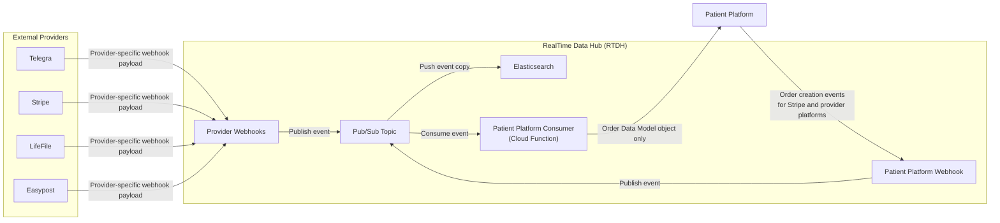

# RealTime Data Hub (RTDH) Integration Architecture

## Overview

This document describes how external provider systems and the Patient Platform exchange order-related events through the RealTime Data Hub (RTDH).

RTDH acts as the centralized event ingress layer. It receives provider-specific webhook payloads, publishes normalized event messages to Pub/Sub, and routes them through the Patient Platform Consumer Cloud Function. Events published to Pub/Sub are also pushed to Elasticsearch for indexing and search/analytics use cases. The consumer is responsible for sending only the **Order Data Model** object to the Patient Platform.

## Repositories

The system spans three primary repositories:

| Repository | Purpose | URL |
|---|---|---|
| RTDH Functions | Cloud Functions and RTDH integration logic | https://github.com/Allia-Health/rt-data-hub-functions |
| Patient Platform Admin | Admin application, Supabase project, Edge Functions, and internal documentation | https://github.com/Allia-Health/patient-platform-admin |
| Patient Platform - Patient UI | Patient-facing CareLink application | https://github.com/Allia-Health/patient-platform-patient-ui |

## Environments

The platform is organized around `development`, `staging`, and `main` branches, with corresponding Supabase and Vercel environments.

### Supabase Projects

| Environment | Role | URL |
|---|---|---|
| Main (prod) | Production Supabase project | https://supabase.com/dashboard/project/dfejvhgwqhywmtxyxkyo |
| Staging | Staging Supabase project | https://supabase.com/dashboard/project/rhzrxfckhogjppjsioyn |
| Dev | Development Supabase project | https://supabase.com/dashboard/project/sunzxjnbgtknqeivljtd |

### Vercel Projects

| Application | Role | URL |
|---|---|---|
| Admin (nexus) | Admin frontend deployment | https://vercel.com/allia-health-group/patient-platform-admin/ |
| Patient UI (CareLink) | Patient-facing frontend deployment | https://vercel.com/allia-health-group/patient_platform_ui_internal |

## Deployment Automation

Supabase and Vercel are automatically updated when changes are pushed to the `development`, `staging`, and `main` branches through GitHub integrations.

RTDH Cloud Functions are automatically updated when changes are pushed to the `development`, `staging`, and `main` branches through GitHub Actions created by Cristovao.

This means branch promotion is not only a source control workflow, but also the deployment control mechanism for the main application surfaces:

- `development` updates the dev environment
- `staging` updates the staging environment
- `main` updates the production environment

## Systems

| System | Role |
|---|---|
| Telegra | External provider sending medical provider-specific events to RTDH webhooks |
| Stripe | External provider sending payment/order-related events to RTDH webhooks |
| LifeFile | External provider sending pharmacy provider-specific events to RTDH webhooks |
| Easypost | External provider sending shipping events to RTDH webhooks |
| Patient Platform | Internal platform that receives Order Data Model objects and also emits events back into RTDH |
| RTDH Webhooks | Webhook ingress layer for provider and Patient Platform events |
| Pub/Sub Topic | Event transport layer used to decouple ingestion from processing |
| Elasticsearch | Search/index store receiving event stream copies from Pub/Sub |
| Patient Platform Consumer | Cloud Function that consumes events and sends Order Data Model objects to Patient Platform |

## Architecture Diagram

## Event Flow

### 1. Provider-to-RTDH Event Ingestion

Each provider sends events to its own webhook endpoint in RTDH.

Examples of providers include:

- Telegra
- Stripe
- LifeFile
- Easypost

Each provider sends its own provider-specific payload format. RTDH receives these payloads at the webhook layer.

### 2. RTDH Publishes Events to Pub/Sub

After receiving an event through a webhook, RTDH publishes the event to a Pub/Sub topic.

The Pub/Sub topic acts as the transport and buffering layer between webhook ingestion and downstream event processing.

Pub/Sub events are also pushed to Elasticsearch as a secondary sink for indexing/search and analytics workloads.

### 3. Patient Platform Consumer Processes Events

The Patient Platform Consumer is implemented as a Cloud Function.

It subscribes to the Pub/Sub topic and processes incoming events.

The consumer is responsible for transforming or selecting the relevant data needed by the Patient Platform.

### 4. Consumer Sends Order Data Model to Patient Platform

Although providers send different payload structures into RTDH, the Patient Platform Consumer only sends the standardized **Order Data Model** object to the Patient Platform.

This keeps Patient Platform isolated from provider-specific payload formats.

### 5. Patient Platform Sends Events Back to RTDH

Patient Platform also sends events to its own webhook endpoint in RTDH.

These events include order creation events that may trigger actions in Stripe and provider platforms.

## Data Contract Boundaries

### Provider Payload Boundary

Provider payloads are accepted by RTDH webhook endpoints as-is.

Each provider owns its payload shape, event naming, and event semantics.

RTDH is responsible for receiving these events and publishing them into the event pipeline.

### Patient Platform Boundary

Patient Platform does not receive raw provider payloads.

It receives only the standardized **Order Data Model** object from the Patient Platform Consumer.

Patient Platform does not consume events from Elasticsearch.

This boundary helps reduce coupling between Patient Platform and external provider implementations.

## Responsibilities

### RTDH

RTDH is responsible for:

- Hosting webhook endpoints for external providers
- Hosting a webhook endpoint for Patient Platform events
- Receiving provider-specific payloads
- Publishing events to Pub/Sub
- Acting as the central event ingress and routing layer

### Pub/Sub

Pub/Sub is responsible for:

- Decoupling webhook ingestion from event processing
- Delivering events to the Patient Platform Consumer
- Pushing event copies to Elasticsearch
- Providing buffering and retry support depending on configuration

### Elasticsearch

Elasticsearch is responsible for:

- Receiving event copies from Pub/Sub
- Supporting indexing, search, and analytics use cases
- Serving as a downstream data sink, not as a source for Patient Platform consumption

### Patient Platform Consumer

The Patient Platform Consumer is responsible for:

- Consuming events from Pub/Sub
- Interpreting provider-specific payloads where needed
- Producing the standardized Order Data Model
- Sending the Order Data Model object to Patient Platform

### Patient Platform

Patient Platform is responsible for:

- Receiving Order Data Model objects
- Emitting order creation events back to RTDH
- Triggering downstream order creation flows for Stripe and provider platforms through RTDH

## Key Design Principles

- **Decoupled ingestion and processing:** Webhooks receive events quickly and publish to Pub/Sub for asynchronous processing.
- **Dual downstream routing from Pub/Sub:** Pub/Sub delivers events to the Patient Platform Consumer and pushes event copies to Elasticsearch.
- **Provider isolation:** Provider-specific payloads are contained within RTDH and the consumer layer.
- **Standardized downstream contract:** Patient Platform receives only the Order Data Model.
- **Bidirectional event flow:** Providers send events into RTDH, and Patient Platform can also emit events back into RTDH.
- **Centralized routing:** RTDH acts as the central integration point for provider and Patient Platform event flows.

## Operational Documentation

Within the Patient Platform Admin repository, all Edge Functions should have their own documentation `.md` file.

The most important operational references for this architecture are:

| Document | Purpose | URL |
|---|---|---|
| Order Lifecycle | Core order lifecycle and order-state handling flows | https://github.com/Allia-Health/patient-platform-admin/blob/development/docs/OrderLifecycleAPI.md |
| Analytics API | Product Usage Tracking ingestion contract, server-side guardrails, and privacy model | https://github.com/Allia-Health/patient-platform-admin/blob/development/docs/AnalyticsAPI.md |
| RTDH Webhook | RTDH webhook contract and ingestion behavior | https://github.com/Allia-Health/patient-platform-admin/blob/development/docs/RTDHWebhookAPI.md |
| RTDH README | RTDH resource usage and supporting implementation details | https://github.com/Allia-Health/rt-data-hub-functions/blob/development/README.md |

## Notes

- Each provider should have a clearly defined webhook endpoint and payload contract.
- The Order Data Model should be versioned and documented separately.
- Patient Platform webhook events should be distinguishable from provider webhook events in Pub/Sub.
- Retry, idempotency, ordering, and dead-letter behavior should be defined at the Pub/Sub and consumer layers.
- The Edge Function documentation in the Patient Platform Admin repository should remain aligned with the deployed behavior in each environment.
